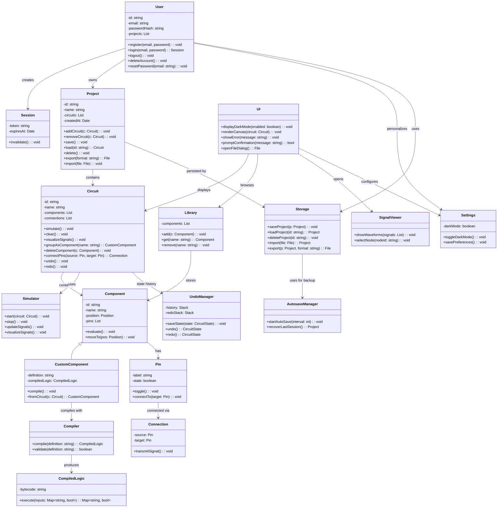

```mermaid
classDiagram
%% =====================
%% Hauptklassen
%% =====================
    class User {
        -id: string
        -email: string
        -passwordHash: string
        -projects: List<Project>
        +register(email, password): void
        +login(email, password): Session
        +logout(): void
        +deleteAccount(): void
        +resetPassword(email: string): void
    }

    class Session {
        -token: string
        -expiresAt: Date
        +invalidate(): void
    }

    class Project {
        -id: string
        -name: string
        -circuits: List<Circuit>
        -createdAt: Date
        +addCircuit(c: Circuit): void
        +removeCircuit(c: Circuit): void
        +save(): void
        +load(id: string): Circuit
        +delete(): void
        +export(format: string): File
        +import(file: File): void
    }

    class Circuit {
        -id: string
        -name: string
        -components: List<Component>
        -connections: List<Connection>
        +simulate(): void
        +clear(): void
        +visualizeSignals(): void
        +groupAsComponent(name: string): CustomComponent
        +deleteComponent(c: Component): void
        +connectPins(source: Pin, target: Pin): Connection
        +undo(): void
        +redo(): void
    }

    class Component {
        -id: string
        -name: string
        -position: Position
        -pins: List<Pin>
        +evaluate(): void
        +moveTo(pos: Position): void
    }

    class CustomComponent {
        -definition: string
        -compiledLogic: CompiledLogic
        +compile(): void
        +fromCircuit(c: Circuit): CustomComponent
    }

    class Pin {
        -label: string
        -state: boolean
        +toggle(): void
        +connectTo(target: Pin): void
    }

    class Connection {
        -source: Pin
        -target: Pin
        +transmitSignal(): void
    }

    class Simulator {
        +start(circuit: Circuit): void
        +stop(): void
        +updateSignals(): void
        +visualizeSignals(): void
    }

    class Library {
        -components: List<Component>
        +add(c: Component): void
        +get(name: string): Component
        +remove(name: string): void
    }

    class Compiler {
        +compile(definition: string): CompiledLogic
        +validate(definition: string): boolean
    }

    class CompiledLogic {
        -bytecode: string
        +execute(inputs: Map~string, bool~): Map~string, bool~
    }

    class UndoManager {
        -history: Stack<CircuitState>
        -redoStack: Stack<CircuitState>
        +saveState(state: CircuitState): void
        +undo(): CircuitState
        +redo(): CircuitState
    }

    class Storage {
        +saveProject(p: Project): void
        +loadProject(id: string): Project
        +deleteProject(id: string): void
        +import(file: File): Project
        +export(p: Project, format: string): File
    }

    class UI {
        +displayDarkMode(enabled: boolean): void
        +renderCanvas(circuit: Circuit): void
        +showError(message: string): void
        +promptConfirmation(message: string): bool
        +openFileDialog(): File
    }

    class Settings {
        -darkMode: boolean
        +toggleDarkMode(): void
        +savePreferences(): void
    }

    class SignalViewer {
        +showWaveforms(signals: List<Signal>): void
        +selectNode(nodeId: string): void
    }

    class AutosaveManager {
        +startAutoSave(interval: int): void
        +recoverLastSession(): Project
    }

%% =====================
%% Beziehungen
%% =====================

    User --> Session : creates
    User --> Project : owns
    User --> Settings : personalizes
    User --> Storage : uses
    Project --> Circuit : contains
    Circuit --> Component : contains
    Component <|-- CustomComponent
    Component --> Pin : has
    Pin --> Connection : connected via
    Circuit --> Simulator : uses
    CustomComponent --> Compiler : compiles with
    Compiler --> CompiledLogic : produces
    Circuit --> UndoManager : state history
    Project --> Storage : persisted by
    Library --> Component : stores
    UI --> Circuit : displays
    UI --> Library : browses
    UI --> SignalViewer : opens
    UI --> Settings : configures
    Storage --> AutosaveManager : uses for backup

```
