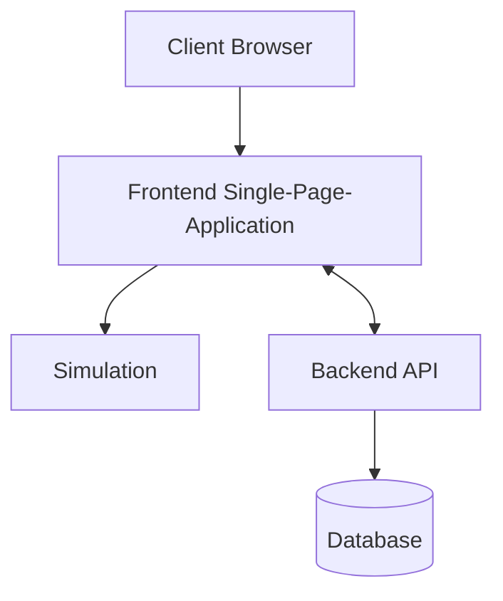
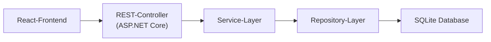

# BitFlow
# Software Architecture Document

Version 1.1

---

## Revision History

Date | Version | Description | Author
---- | ------- | ----------- | ------
<08/12/25> | <1.0> | Erstellung des Dokuments und erste Einträge | BitFlow-Team
<22/12/25> | <1.1> | Vollständige Ausfüllung | BitFlow-Team

---

# Table of Contents

1. Introduction  
&emsp;1.1 Purpose  
&emsp;1.2 Scope  
&emsp;1.3 Definitions, Acronyms and Abbreviations  
&emsp;1.4 References  
&emsp;1.5 Overview  

2. Architectural Representation  

3. Architectural Goals and Constraints  

4. Use-Case View  

5. Logical View  
&emsp;5.1 Overview  
&emsp;5.2 Architecturally Significant Design Packages  
&emsp;5.3 Use-Case Realizations  

6. Process View  

7. Deployment View  

8. Implementation View  
&emsp;8.1 Overview  
&emsp;8.2 Layers  

9. Data View (optional)  

10. Size and Performance  

11. Quality  

---

# Software Architecture Document

## 1. Introduction

Dieses Dokument beschreibt die Software-Architektur von **BitFlow**, einem browserbasierten Logikschaltungs-Editor und -Simulator.  
Die Architektur wird anhand des **4+1-Sichtenmodells nach Kruchten** dargestellt und fasst die wesentlichen Architekturentscheidungen, Qualitätsziele und Strukturen des Systems zusammen.

### 1.1 Purpose

Ziel dieses Dokuments ist es, die wesentlichen architektonischen Entscheidungen von BitFlow nachvollziehbar zu dokumentieren.  
Es dient als gemeinsame Grundlage für Entwicklung, Bewertung und Weiterentwicklung des Systems und richtet sich an Entwickler, Projektbeteiligte und Lehrende.

### 1.2 Scope

Das Software Architecture Document gilt für das gesamte BitFlow-System, einschließlich:
- grafischem Editor für Logikschaltungen,
- Simulationslogik,
- Bausteinbibliothek (inkl. benutzerdefinierter Bausteine),
- Persistenzmechanismen sowie
- optionalem Backend für Benutzer- und Projektdaten.

### 1.3 Definitions, Acronyms and Abbreviations

- **ASR**: Architecture Significant Requirement  
- **UI**: User Interface  
- **SPA**: Single Page Application  
- **SRP**: Single Responsibility Principle  

### 1.4 References

- [Software Requirements Specification (SRS)](https://github.com/SimonJ2222/BitFlow/blob/main/docs/use_cases/software_requirements_specification.md)
- [Architecture Significant Requirements (ASR)](https://github.com/SimonJ2222/BitFlow/blob/main/docs/Architecture%20Significant%20Requirements%20(ASR).md)
- [Vorlesungsunterlagen „Software Engineering“](https://moodle.dhbw.de/course/view.php?id=12128) 

### 1.5 Overview

Das Dokument ist entsprechend dem Software Architecture Document aufgebaut und gliedert die Architektur von BitFlow in mehrere Sichten.  
Neben funktionalen Aspekten werden insbesondere Qualitätsanforderungen, Laufzeitverhalten, Deployment sowie zentrale Entwurfsentscheidungen beschrieben.

---

## 2. Architectural Representation

Die Software-Architektur von BitFlow wird anhand des **4+1-Sichtenmodells nach Kruchten** beschrieben. Dieses Modell ermöglicht es, die Architektur aus verschiedenen Perspektiven darzustellen und sowohl funktionale als auch nicht-funktionale Anforderungen angemessen zu berücksichtigen.

Für BitFlow werden die folgenden Sichten verwendet:

- **Use-Case View:** Beschreibt die funktionalen Anforderungen des Systems aus Sicht der Benutzer und zeigt, welche Anwendungsfälle architektonisch relevant sind.
- **Logical View:** Stellt die statische Struktur des Systems dar, insbesondere Klassen, Pakete und deren Beziehungen.
- **Process View:** Beschreibt das Laufzeitverhalten, die Nebenläufigkeit sowie die Kommunikation zwischen den zentralen Komponenten.
- **Deployment View:** Zeigt die physische Verteilung der Software auf Hardware- und Laufzeitumgebungen.
- **Implementation View:** Beschreibt die Aufteilung des Systems in Komponenten, Module und Schichten.

Diese Sichten ergänzen sich gegenseitig und bilden gemeinsam eine konsistente Beschreibung der Gesamtarchitektur von BitFlow.

---

## 3. Architectural Goals and Constraints

Die Architektur von BitFlow wird durch mehrere qualitätsrelevante Anforderungen geprägt, die maßgeblich beeinflussen, wie das System strukturiert und entwickelt wird. Diese Architecture Significant Requirements (ASR) bestimmen insbesondere die Wahl der Module, Abhängigkeiten und Entwurfsmuster.

### 3.1 Wichtige Qualitätsziele (ASRs)

**Performance**  
- Änderungen in Schaltungen bis ca. 200 Bausteinen müssen innerhalb von ≤ 50 ms verarbeitet werden.  
- UI soll jederzeit flüssig bleiben (≥ 30 FPS), selbst während Simulation und Interaktionen.

**Usability**  
- Drag & Drop und visuelle Interaktionen müssen ohne wahrnehmbare Verzögerungen funktionieren.  
- Leitungszustände, Fehlermeldungen und Simulationsergebnisse sollen sofort angezeigt werden.

**Reliability**  
- Undo/Redo muss stabil funktionieren und Systemzustände zuverlässig wiederherstellen.  
- Autosave verhindert Datenverlust (≤ 10 Sekunden).  
- Fehler in Simulation oder Bausteinen dürfen die UI nicht blockieren.

**Modifiability**  
- Neue Bausteine (benutzerdefiniert oder systemseitig) sollen einfach integrierbar sein.  
- Simulation, Speichermechanismen und Validierungsstrategien müssen austauschbar sein.  
- Module sollen klar gekapselt und unabhängig voneinander testbar sein.

**Security**  
- Nur authentifizierte Nutzer dürfen Projekte anzeigen oder bearbeiten.  
- Projekte müssen eindeutig einem Benutzer zugeordnet werden.

**Availability**  
- UI muss verfügbar bleiben, selbst wenn die Simulation Fehler wirft.  
- Der Simulationsprozess soll isoliert laufen und bei Bedarf automatisch neu starten.

---

### 3.2 Zentrale Architekturentscheidungen

- Strikte Trennung der Kernbereiche: **UI**, **Application Services**, **Domain**, **Simulation**, **Storage**, **Library**.  
- Simulation läuft in einem separaten Ausführungsprozess (z. B. WebWorker), um UI-Blockaden zu vermeiden.  
- Alle Bausteintypen basieren auf einheitlichen abstrakten Interfaces.  
- Undo/Redo wird über Zustandssnapshots realisiert, nicht über Kommandohistorien.  
- Benutzerdefinierte Bausteine werden über einen separaten Compiler validiert.  
- UI kommuniziert ausschließlich über Services und nicht direkt mit der Domain.

---

### 3.3 Technische Randbedingungen

- Anwendung muss vollständig im Browser lauffähig sein (React + TypeScript).  
- Keine Plugins oder native Komponenten; nur Web-Standards.  
- Persistenz erfolgt flexibel über LocalStorage oder Backend-APIs.  
- Zielplattformen: Chrome, Firefox, Safari, Edge.  
- Simulation muss deterministisch sein, um Debugging und Testbarkeit sicherzustellen.
---

## 4. Use-Case View

Der Use-Case View beschreibt die funktionalen Anforderungen von BitFlow aus Sicht der Benutzer und zeigt, welche Anwendungsfälle architektonisch besonders relevant sind. Die folgenden Use Cases decken die Kernfunktionalität des Systems ab und beeinflussen mehrere Architekturkomponenten gleichzeitig.

### Architektonisch signifikante Use Cases

- **Schaltung erstellen und bearbeiten**  
  Benutzer platzieren Bausteine per Drag & Drop, verbinden diese über Leitungen und konfigurieren Eingänge. Dieser Use Case betrifft UI, Domain-Modell und Validierungslogik.

- **Simulation starten und ausführen**  
  Die erstellte Schaltung wird in Echtzeit simuliert. Dieser Use Case ist zentral für Performance- und Availability-Anforderungen und erfordert eine klare Trennung zwischen UI und Simulation.

- **Benutzerdefinierte Bausteine erstellen**  
  Benutzer fassen bestehende Schaltungen zu neuen Bausteinen zusammen. Dieser Use Case beeinflusst die Bausteinbibliothek, den Compiler sowie die Modifiability der Architektur.

- **Undo / Redo von Aktionen**  
  Benutzer können Bearbeitungsschritte rückgängig machen oder wiederherstellen. Dieser Use Case ist architektonisch relevant für Reliability und Konsistenz des Systemzustands.

- **Projekt speichern und laden**  
  Schaltungen werden persistent gespeichert und wiederhergestellt. Dieser Use Case betrifft Storage, Datenmodell und Schnittstellen zwischen Frontend und Persistenz.

---

## 5. Logical View

Der Logical View beschreibt die statische Struktur des Systems und zeigt, wie die Software in logisch zusammenhängende Pakete und Klassen zerlegt ist. Der Fokus liegt auf den architektonisch signifikanten Teilen des Designmodells und deren Verantwortlichkeiten.

### 5.1 Overview

Das logische Modell von BitFlow ist in mehrere klar abgegrenzte Bereiche unterteilt, die den zentralen Verantwortlichkeiten des Systems entsprechen. Die Architektur folgt dem Prinzip der **Separation of Concerns** und orientiert sich an einer schichtenähnlichen Struktur.

Die wichtigsten logischen Bereiche sind:
- **UI-nahe Komponenten** für Benutzerinteraktion,
- **Application Services** zur Orchestrierung von Use Cases,
- **Domain-Modelle** zur Abbildung von Schaltungen und Bausteinen,
- **Simulation** zur Berechnung von Signalzuständen,
- **Persistenz- und Bibliothekskomponenten** für Speicherung und Wiederverwendung.

Abhängigkeiten verlaufen dabei ausschließlich von höher- zu niedrigerliegenden Abstraktionsebenen.

---

### 5.2 Architecturally Significant Design Packages

#### UI Package
- **Beschreibung:** Enthält alle Klassen zur Darstellung und Interaktion mit dem Benutzer.
- **Beispiele:** `EditorView`, `Canvas`, `Toolbar`
- **Verantwortlichkeiten:** Darstellung, Benutzerinteraktion, Weiterleitung von Aktionen an Application Services.

#### Application Package
- **Beschreibung:** Vermittelt zwischen UI und Domain.
- **Beispiele:** `EditorService`, `SimulationService`, `UndoRedoService`
- **Verantwortlichkeiten:** Use-Case-Steuerung, Validierung, Koordination von Abläufen.

#### Domain Package
- **Beschreibung:** Zentrales Fachmodell von BitFlow.
- **Beispiele:** `Circuit`, `Component`, `CustomComponent`, `Wire`, `Pin`
- **Verantwortlichkeiten:** Repräsentation der Schaltung, Struktur, Konsistenzregeln.

#### Simulation Package
- **Beschreibung:** Kapselt die Simulationslogik.
- **Beispiele:** `SimulationEngine`, `SimulationStrategy`
- **Verantwortlichkeiten:** Berechnung von Signalzuständen, Zustandsänderungen.

#### Library Package
- **Beschreibung:** Zentrale Registry für verfügbare Bausteine.
- **Beispiele:** `ComponentLibrary`, `ComponentFactory`
- **Verantwortlichkeiten:** Verwaltung und Erzeugung von Standard- und benutzerdefinierten Bausteinen.

#### Storage Package
- **Beschreibung:** Abstraktion der Persistenzmechanismen.
- **Beispiele:** `StorageRepository`, `ProjectSerializer`
- **Verantwortlichkeiten:** Speichern, Laden, Import/Export von Projekten.

---

### 5.3 Use-Case Realizations

Die Realisierung der Use Cases erfolgt über Application Services, die als zentrale Einstiegspunkte dienen.  
Beispielsweise wird der Use Case *„Simulation starten“* wie folgt umgesetzt:

1. UI löst Aktion über einen Application Service aus.  
2. Service validiert den aktuellen Schaltungszustand.  
3. Simulation Engine wird initialisiert und gestartet.  
4. Zustandsänderungen werden über Observer an die UI zurückgemeldet.

Dieses Vorgehen stellt sicher, dass UI, Domain und Simulation lose gekoppelt bleiben und unabhängig weiterentwickelt werden können.

---

## 6. Process View

Die Process View beschreibt die Laufzeitarchitektur von BitFlow, insbesondere Threads, asynchrone Abläufe und Interaktionen zwischen UI und Simulation. Sequenzdiagramme sind in den einzelnen [Use-Cases](https://github.com/SimonJ2222/BitFlow/blob/main/docs/use_cases/software_requirements_specification.md#3-specific-requirements) zu finden.

### 6.1 Hauptprozesse

1. UI-Thread (Browser Hauptthread)
- Rendern des Editors und der Bauteine
- Drag & Drop
- Leitungsvisualisierung
- Undo/Redo
- Kommunikation mit Simulation und Storage
- Fehleranzeigen und Nutzerinteraktion
Der UI-Thread darf nie blockiert werden, daher laufen schwere Berechnungen woanders.

2. Simulationsprozess (WebWorker / eigener Thread)
- Berechnet Signalflüsse
- Verarbeitet Ereignisse (Event-Driven Simulation)
- Stoppt nicht bei Fehlern, sondern sendet Rückmeldung an UI
- Neustart erfolgt automatisch bei Abstürzen (Availability-Taktik)
Vorteil: UI bleibt responsiv, Simulation skaliert besser.

3. Autosave-Prozess (Timer-basiert, asynchron)
- Speichert alle 30 Sekunden
Kann sowohl lokal als auch über API laufen

4. Compiler-Prozess für benutzerdefinierte Bausteine
- Validiert neue Bausteindefinitionen
- Erzeugt „Compiled Logic“
- Gibt im Fehlerfall Meldungen zurück

### 6.2 Kommunikationsmodell

- Message Passing zwischen UI und Simulation (JSON-Events).
- Observer/Subscriber-Pattern im UI für Zustandsänderungen.
- Asynchrone Aufrufe an Storage-Services.

---

## 7. Deployment View

Der Deployment View beschreibt die physische Verteilung der Softwarekomponenten von BitFlow auf die beteiligten Laufzeitumgebungen sowie deren Kommunikation untereinander. BitFlow ist als browserbasierte Webanwendung konzipiert und benötigt keine lokale Installation.

### 7.1 Deployment Diagram

### 7.2 Beschreibung

- Die Benutzeroberfläche wird als Single Page Application im Browser ausgeführt.
- Die Simulationslogik läuft in einem separaten Simulationsdienst bzw. Ausführungskontext, um die Benutzeroberfläche responsiv zu halten.
- Ein optionales Backend stellt Funktionen für Authentifizierung, Benutzerverwaltung und persistente Speicherung bereit.
- Die Datenbank speichert Benutzerkonten und Projektinformationen.
- Die Kommunikation zwischen Frontend und Backend erfolgt über HTTP-basierte Schnittstellen.

Diese Deployment-Struktur unterstützt insbesondere die Anforderungen an **Performance**, **Availability** und **Portability**.

---

## 8. Implementation View

### 8.1 Overview

Die Implementierung ist in klar getrennte Schichten gegliedert, die Änderungen erleichtern, Testbarkeit erhöhen und die Simulation isolieren:
- UI Layer (React/TypeScript)
- Domain Layer (Simulation, Schaltung, Bausteine)
- Library Layer (Standard- & Custom-Bausteine)
- Storage Layer
- Diese Layer kommunizieren nur über definierte Schnittstellen.

### 8.2 Layers

1. UI Layer
- Beinhaltet:
- Editor-Canvas
- Bauteil-Panel
- Inspector
- Fehlermeldungen
- Undo/Redo UI

2. Domain Layer

- Component
- Wire
- Circuit
- Simulator
- Compiler
- Validation

Umfasst die eigentliche Logik.

3. Library Layer

- Vordefinierte Gatter (AND, OR, NOT etc.)
- Benutzerdefinierte Bausteine
- Factory Pattern zur Erzeugung

4. Storage Layer

- Lokale Speicherung
- Backend-APIs
- Repository Pattern
---

### 8.3 Layer Kommunikation

---

## 9. Data View

BitFlow verwendet persistente Speicherung zur Ablage von Benutzerprojekten und zugehörigen Metadaten. Die Datenhaltung ist bewusst einfach gehalten und folgt der logischen Struktur der Domänenobjekte.

### 9.1 Persistente Daten

- **User**
  - user_id
  - email
  - password_hash

- **Project**
  - project_id
  - user_id
  - name
  - last_modified

- **Circuit**
  - circuit_id
  - project_id
  - serialized_structure

- **ComponentDefinition**
  - component_id
  - name
  - type (standard / custom)
  - definition_data

### 9.2 Beschreibung

- Projekte und Schaltungen werden strukturiert serialisiert gespeichert.
- Benutzerdefinierte Bausteine werden als eigene Definitionen persistiert.
- Die Persistenz kann lokal (z. B. Browser Storage) oder serverseitig erfolgen.
- Das Datenmodell unterstützt Versionierung und Wiederherstellung (Autosave).

Dieses Datenmodell unterstützt die Anforderungen an **Reliability** und **Modifiability**.

---

## 10. Size and Performance

[A description of the major dimensioning characteristics of the software that impact the architecture, as well as the
target performance constraints.]

---

## 11. Quality

Hier werden die wichtigsten Architekturtaktiken zusammengefasst, die BitFlow nutzt, um die Anforderungen aus den ASRs zu erfüllen.

1. Modifiability

- Klare Trennung von UI, Domain, Storage, Simulation.
- Bausteine als austauschbare Komponenten mit einheitlicher Schnittstelle.
- Compiler erlaubt neue benutzerdefinierte Bausteine.
- Information Hiding schützt interne Details.

2. Performance

- Event-Driven Simulation (nur relevante Signaländerungen).
- Batch-Updates im UI statt Einzelupdates.
- Asynchrone Simulation in separatem Prozess.

3. Usability

- Sofortiges visuelles Feedback bei Interaktionen.
- Farbliche Darstellung von Signalzuständen.
- Undo/Redo mit Snapshot-Technik.

4. Testability

- Modulare Architektur (SRP).
- Simulation, Storage und Compiler über Interfaces mockbar.
- Deterministische Simulation erlaubt reproduzierbare Tests.
- Klare API-Grenze zwischen UI und Domain.

5. Reliability

- Validierung vor Simulation.
- Fehlerbehandlung ohne UI-Stillstand.
- Automatisches Recovering und Autosave.

