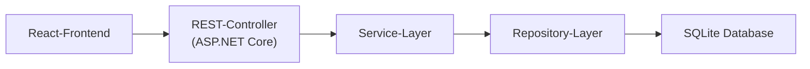

# BitFlow
# Software Architecture Document

Version 1.0

---

## Revision History

Date | Version | Description | Author
---- | ------- | ----------- | ------
<dd/mmm/yy> | <x.x> | 
 | <name>

---

# Table of Contents

1. Introduction  
&emsp;1.1 Purpose  
&emsp;1.2 Scope  
&emsp;1.3 Definitions, Acronyms and Abbreviations  
&emsp;1.4 References  
&emsp;1.5 Overview  

2. Architectural Representation  

3. Architectural Goals and Constraints  

4. Use-Case View  

5. Logical View  
&emsp;5.1 Overview  
&emsp;5.2 Architecturally Significant Design Packages  
&emsp;5.3 Use-Case Realizations  

6. Process View  

7. Deployment View  

8. Implementation View  
&emsp;8.1 Overview  
&emsp;8.2 Layers  

9. Data View (optional)  

10. Size and Performance  

11. Quality  

---

# Software Architecture Document

## 1. Introduction

[The introduction of the Software Architecture Document should provide an overview of the entire Software 
Architecture Document. It should include the purpose, scope, definitions, acronyms, abbreviations, references, and
overview of the Software Architecture Document.]

### 1.1 Purpose

This document provides a comprehensive architectural overview of the system, using a number of different architectural views
to depict different aspects of the system. It is intended to capture and convey the significant architectural decisions which have
been made on the system.

[This section defines the purpose of the Software Architecture Document, in the overall project documentation, and
briefly describes the structure of the document. The specific audiences for the document should be identified, with an
indication of how they are expected to use the document.]

### 1.2 Scope

[A brief description of what the Software Architecture Document applies to; what is affected or influenced by this
document.]

### 1.3 Definitions, Acronyms and Abbreviations

[This subsection should provide the definitions of all terms, acronyms, and abbreviations required to properly
interpret the Software Architecture Document. This information may be provided by reference to the project
Glossary.]

### 1.4 References

[This subsection should provide a complete list of all documents referenced elsewhere in the Software Architecture 
Document. Each document should be identified by title, report number (if applicable), date, and publishing
organization. Specify the sources from which the references can be obtained. This information may be provided by
reference to an appendix or to another document.]

### 1.5 Overview

[This subsection should describe what the rest of the Software Architecture Document contains and explain how the 
Software Architecture Document is organized.]

---

## 2. Architectural Representation

[This section describes what software architecture is for the current system, and how it is represented. Of the
Use-Case, Logical, Process, Deployment, and Implementation Views, it enumerates the views that are necessary,
and for each view, explains what types of model elements it contains.]

---

## 3. Architectural Goals and Constraints

Die Architektur von BitFlow wird durch mehrere qualitätsrelevante Anforderungen geprägt, die maßgeblich beeinflussen, wie das System strukturiert und entwickelt wird. Diese Architecture Significant Requirements (ASR) bestimmen insbesondere die Wahl der Module, Abhängigkeiten und Entwurfsmuster.

### 3.1 Wichtige Qualitätsziele (ASRs)

**Performance**  
- Änderungen in Schaltungen bis ca. 200 Bausteinen müssen innerhalb von ≤ 50 ms verarbeitet werden.  
- UI soll jederzeit flüssig bleiben (≥ 30 FPS), selbst während Simulation und Interaktionen.

**Usability**  
- Drag & Drop und visuelle Interaktionen müssen ohne wahrnehmbare Verzögerungen funktionieren.  
- Leitungszustände, Fehlermeldungen und Simulationsergebnisse sollen sofort angezeigt werden.

**Reliability**  
- Undo/Redo muss stabil funktionieren und Systemzustände zuverlässig wiederherstellen.  
- Autosave verhindert Datenverlust (≤ 10 Sekunden).  
- Fehler in Simulation oder Bausteinen dürfen die UI nicht blockieren.

**Modifiability**  
- Neue Bausteine (benutzerdefiniert oder systemseitig) sollen einfach integrierbar sein.  
- Simulation, Speichermechanismen und Validierungsstrategien müssen austauschbar sein.  
- Module sollen klar gekapselt und unabhängig voneinander testbar sein.

**Security**  
- Nur authentifizierte Nutzer dürfen Projekte anzeigen oder bearbeiten.  
- Projekte müssen eindeutig einem Benutzer zugeordnet werden.

**Availability**  
- UI muss verfügbar bleiben, selbst wenn die Simulation Fehler wirft.  
- Der Simulationsprozess soll isoliert laufen und bei Bedarf automatisch neu starten.

---

### 3.2 Zentrale Architekturentscheidungen

- Strikte Trennung der Kernbereiche: **UI**, **Application Services**, **Domain**, **Simulation**, **Storage**, **Library**.  
- Simulation läuft in einem separaten Ausführungsprozess (z. B. WebWorker), um UI-Blockaden zu vermeiden.  
- Alle Bausteintypen basieren auf einheitlichen abstrakten Interfaces.  
- Undo/Redo wird über Zustandssnapshots realisiert, nicht über Kommandohistorien.  
- Benutzerdefinierte Bausteine werden über einen separaten Compiler validiert.  
- UI kommuniziert ausschließlich über Services und nicht direkt mit der Domain.

---

### 3.3 Technische Randbedingungen

- Anwendung muss vollständig im Browser lauffähig sein (React + TypeScript).  
- Keine Plugins oder native Komponenten; nur Web-Standards.  
- Persistenz erfolgt flexibel über LocalStorage oder Backend-APIs.  
- Zielplattformen: Chrome, Firefox, Safari, Edge.  
- Simulation muss deterministisch sein, um Debugging und Testbarkeit sicherzustellen.
---

## 4. Use-Case View

[This section lists use cases or scenarios from the use-case model if they represent some significant, central
functionality of the final system, or if they have a large architectural coverage - they exercise many architectural
elements, or if they stress or illustrate a specific, delicate point of the architecture.]

---

## 5. Logical View

[This section describes the architecturally significant parts of the design model, such as its decomposition into
subsystems and packages. And for each significant package, its decomposition into classes and class utilities. You
should introduce architecturally significant classes and describe their responsibilities, as well as a few very important
relationships, operations, and attributes.]

### 5.1 Overview

[This subsection describes the overall decomposition of the design model in terms of its package hierarchy and
layers.]

### 5.2 Architecturally Significant Design Packages

[For each significant package, include a subsection with its name, its brief description, and a diagram with all
significant classes and packages contained within the package.

For each significant class in the package, include its name, brief description, and, optionally a description of some of
its major responsibilities, operations and attributes.]

### 5.3 Use-Case Realizations

[This section illustrates how the software actually works by giving a few selected use-case (or scenario) realizations,
and explains how the various design model elements contribute to their functionality.]

---

## 6. Process View

Die Process View beschreibt die Laufzeitarchitektur von BitFlow, insbesondere Threads, asynchrone Abläufe und Interaktionen zwischen UI und Simulation. Sequenzdiagramme sind in den einzelnen [Use-Cases](https://github.com/SimonJ2222/BitFlow/blob/main/docs/use_cases/software_requirements_specification.md#3-specific-requirements) zu finden.

### 6.1 Hauptprozesse

1. UI-Thread (Browser Hauptthread)
- Rendern des Editors und der Bauteine
- Drag & Drop
- Leitungsvisualisierung
- Undo/Redo
- Kommunikation mit Simulation und Storage
- Fehleranzeigen und Nutzerinteraktion
Der UI-Thread darf nie blockiert werden, daher laufen schwere Berechnungen woanders.

2. Simulationsprozess (WebWorker / eigener Thread)
- Berechnet Signalflüsse
- Verarbeitet Ereignisse (Event-Driven Simulation)
- Stoppt nicht bei Fehlern, sondern sendet Rückmeldung an UI
- Neustart erfolgt automatisch bei Abstürzen (Availability-Taktik)
Vorteil: UI bleibt responsiv, Simulation skaliert besser.

3. Autosave-Prozess (Timer-basiert, asynchron)
- Speichert alle 30 Sekunden
Kann sowohl lokal als auch über API laufen

4. Compiler-Prozess für benutzerdefinierte Bausteine
- Validiert neue Bausteindefinitionen
- Erzeugt „Compiled Logic“
- Gibt im Fehlerfall Meldungen zurück

### 6.2 Kommunikationsmodell

- Message Passing zwischen UI und Simulation (JSON-Events).
- Observer/Subscriber-Pattern im UI für Zustandsänderungen.
- Asynchrone Aufrufe an Storage-Services.

---

## 7. Deployment View

[This section describes one or more physical network (hardware) configurations on which the software is deployed
and run. It is a view of the Deployment Model. At a minimum for each configuration it should indicate the physical
nodes (computers, CPUs) that execute the software, and their interconnections (bus, LAN, point-to-point, and so on.)
Also include a mapping of the processes of the Process View onto the physical nodes.]

---

## 8. Implementation View

### 8.1 Overview

Die Implementierung ist in klar getrennte Schichten gegliedert, die Änderungen erleichtern, Testbarkeit erhöhen und die Simulation isolieren:
- UI Layer (React/TypeScript)
- Domain Layer (Simulation, Schaltung, Bausteine)
- Library Layer (Standard- & Custom-Bausteine)
- Storage Layer
- Diese Layer kommunizieren nur über definierte Schnittstellen.

### 8.2 Layers

1. UI Layer
- Beinhaltet:
- Editor-Canvas
- Bauteil-Panel
- Inspector
- Fehlermeldungen
- Undo/Redo UI

2. Domain Layer

- Component
- Wire
- Circuit
- Simulator
- Compiler
- Validation

Umfasst die eigentliche Logik.

3. Library Layer

- Vordefinierte Gatter (AND, OR, NOT etc.)
- Benutzerdefinierte Bausteine
- Factory Pattern zur Erzeugung

4. Storage Layer

- Lokale Speicherung
- Backend-APIs
- Repository Pattern
---

### 8.3 Layer Kommunikation

## 9. Data View (optional)

[A description of the persistent data storage perspective of the system. This section is optional if there is little or no
persistent data, or the translation between the Design Model and the Data Model is trivial.]

---

## 10. Size and Performance

[A description of the major dimensioning characteristics of the software that impact the architecture, as well as the
target performance constraints.]

---

## 11. Quality

Hier werden die wichtigsten Architekturtaktiken zusammengefasst, die BitFlow nutzt, um die Anforderungen aus den ASRs zu erfüllen.

1. Modifiability

- Klare Trennung von UI, Domain, Storage, Simulation.
- Bausteine als austauschbare Komponenten mit einheitlicher Schnittstelle.
- Compiler erlaubt neue benutzerdefinierte Bausteine.
- Information Hiding schützt interne Details.

2. Performance

- Event-Driven Simulation (nur relevante Signaländerungen).
- Batch-Updates im UI statt Einzelupdates.
- Asynchrone Simulation in separatem Prozess.

3. Usability

- Sofortiges visuelles Feedback bei Interaktionen.
- Farbliche Darstellung von Signalzuständen.
- Undo/Redo mit Snapshot-Technik.

4. Testability

- Modulare Architektur (SRP).
- Simulation, Storage und Compiler über Interfaces mockbar.
- Deterministische Simulation erlaubt reproduzierbare Tests.
- Klare API-Grenze zwischen UI und Domain.

5. Reliability

- Validierung vor Simulation.
- Fehlerbehandlung ohne UI-Stillstand.
- Automatisches Recovering und Autosave.

