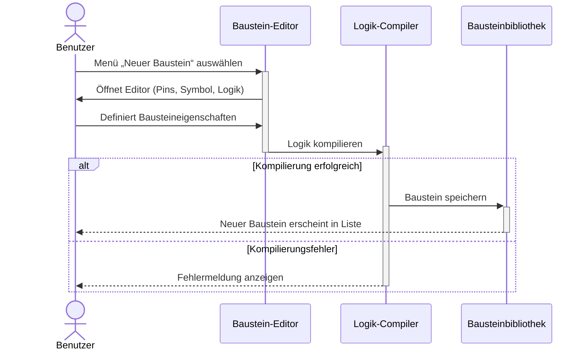

# BitFlow - Use-Case: Benutzerdefinierte Logikbausteine erstellen

## Table of Contents
- [BitFlow - Use-Case: Benutzerdefinierte Logikbausteine erstellen](#bitflow---use-case-benutzerdefinierte-logikbausteine-erstellen)
  - [Table of Contents](#table-of-contents)
  - [1. Introduction](#1-introduction)
    - [1.1 Purpose](#11-purpose)
    - [1.2 Scope](#12-scope)
    - [1.3 Definitions, Acronyms, and Abbreviations](#13-definitions-acronyms-and-abbreviations)
    - [1.4 References](#14-references)
    - [1.5 Overview](#15-overview)
  - [2. Flow of Events-Design](#2-flow-of-eventsdesign)
  - [3. Derived Requirements](#3-derived-requirements)

## 1. Introduction

### 1.1 Purpose
Dieses Dokument beschreibt die Realisierung des Use-Cases **„Benutzerdefinierte Logikbausteine erstellen“** im Rahmen des Projekts **BitFlow**. Ziel ist es, die technische Umsetzung und Interaktion der beteiligten Objekte (z. B. Editor, Compiler, Bibliothek) zu dokumentieren.

### 1.2 Scope
Der Use-Case bezieht sich auf die Funktionalität, mit der Benutzer eigene Logikbausteine definieren und speichern können. Er umfasst das Öffnen des Baustein-Editors, das Erstellen der Bausteinlogik, das Kompilieren sowie das Speichern in der Bibliothek.

### 1.3 Definitions, Acronyms, and Abbreviations
- **Baustein**: Ein logisches Modul mit definierten Eingängen, Ausgängen und Verhalten.  
- **Compiler**: Komponente, die Logikdefinitionen prüft und in ausführbare Bausteinform überführt.  
- **Bibliothek**: Sammlung aller verfügbaren Logikbausteine im System.  
- **Editor**: UI-Komponente zur Erstellung und Bearbeitung von Bausteinen.  

### 1.4 References
- BitFlow Software Requirements Specification (SRS), Abschnitt 3.1.9  
- Projekt-Mockups: [Benutzerdefinierte Logikbausteine erstellen](https://github.com/SimonJ2222/BitFlow/blob/main/docs/mockups/Projekt%20bearbeiten%20Benutzerdefinierte%20Bausteine.png)

### 1.5 Overview
Kapitel 2 beschreibt die technische Realisierung des Use-Cases in Form einer textuellen Beschreibung und eines Sequenzdiagramms. Kapitel 3 enthält abgeleitete Anforderungen und Hinweise für die Implementierung.

## 2. Flow of Events-Design 

### 2.1 Überblick
Der Use-Case wird durch den Benutzer über das Menü **„Neuer Baustein“** gestartet. Das System öffnet den **Baustein-Editor**, in dem der Benutzer Pins, Symbole und Logik definiert. Anschließend wird die Logik über den **Compiler** überprüft und bei Erfolg als neuer Baustein in der **Bibliothek** gespeichert.

### 2.2 Beteiligte Objekte
- **Benutzer:**  initiiert den Prozess und definiert den Baustein.  
- **Baustein-Editor:**  UI-Komponente zur Erstellung und Bearbeitung der Bausteine.  
- **Logik-Compiler:**  validiert und kompiliert die definierte Logik.  
- **Bausteinbibliothek:**  speichert und verwaltet alle erstellten Bausteine.

### 2.3 Ablaufbeschreibung
1. **Benutzer:** Der Benutzer wählt im Menü die Option **„Neuer Baustein“**.  
2. **Editor:** Das System öffnet den Editor, der Eingabefelder für Pins, Symbol und Logik bereitstellt.  
3. **Benutzer:** Der Benutzer legt die Eigenschaften und Logik des Bausteins fest (z. B. Wahrheitstabelle oder logische Ausdrücke).  
4. **Editor:** Die definierte Logik wird an den Compiler übergeben.  
5. **Compiler:** Der Compiler überprüft die Logik.  
   - **Erfolgreiche Kompilierung:** Der Compiler gibt das kompilierte Ergebnis an die Bibliothek weiter.  
   - **Fehlerhafte Kompilierung:** Eine Fehlermeldung wird an den Benutzer zurückgegeben.  
6. **Compiler:** Bei Erfolg wird der neue Baustein gespeichert.  
7. **Bibliothek:** Der neue Baustein erscheint in der Bausteinliste und steht zur weiteren Verwendung bereit.

### 2.4 Sequenzdiagramm

### 2.5 Zusammenhang der Komponenten

1. Der Baustein-Editor fungiert als Vermittler zwischen Benutzerinteraktion und Logikverarbeitung.
2. Der Compiler übernimmt die Validierung und Erzeugung des Bausteins.
3. Die Bibliothek dient als persistent layer für die Speicherung und spätere Nutzung.
Der Prozess folgt dem MVC-Muster: Benutzeraktionen (Controller) führen zur Änderung von Logikdefinitionen (Model), die im Editor (View) dargestellt werden.

## 3. Derived Requirements
1. Fehlerbehandlung:
Das System muss den Benutzer über Kompilierungsfehler informieren, einschließlich Fehlermeldung und fehlerhafter Logikstelle.

2. Validierung:
Eingaben des Benutzers müssen auf syntaktische und semantische Korrektheit geprüft werden, bevor sie kompiliert werden.

3. Persistenz:
Kompilierte Bausteine müssen dauerhaft in der Bibliothek gespeichert und bei Neustart wiederhergestellt werden können.

4. Performance:
Die Kompilierung eines Bausteins sollte innerhalb von <1 Sekunde bei Standardkomplexität erfolgen.

6. Benutzerfreundlichkeit:
Der Editor soll eine visuelle Rückmeldung geben (z. B. grüne Markierung bei erfolgreicher Kompilierung).
