# BitFlow - Software Requirements Specification 

## Table of contents
- [Table of contents](#table-of-contents)
- [Introduction](#1-introduction)
    - [Purpose](#11-purpose)
    - [Scope](#12-scope)
    - [Definitions, Acronyms and Abbreviations](#13-definitions-acronyms-and-abbreviations)
    - [References](#14-references)
    - [Overview](#15-overview)
- [Overall Description](#2-overall-description)
    - [Vision](#21-vision)
    - [Use Case Diagram](#22-use-case-diagram)
	- [Technology Stack](#23-technology-stack)
- [Specific Requirements](#3-specific-requirements)
    - [Functionality](#31-functionality)
    - [Usability](#32-usability)
    - [Reliability](#33-reliability)
    - [Performance](#34-performance)
    - [Supportability](#35-supportability)
    - [Design Constraints](#36-design-constraints)
    - [Online User Documentation and Help System Requirements](#37-on-line-user-documentation-and-help-system-requirements)
    - [Purchased Components](#purchased-components)
    - [Interfaces](#39-interfaces)
    - [Licensing Requirements](#310-licensing-requirements)
    - [Legal, Copyright And Other Notices](#311-legal-copyright-and-other-notices)
    - [Applicable Standards](#312-applicable-standards)
- [Supporting Information](#4-supporting-information)

## 1. Introduction

### 1.1 Purpose
Dieses Dokument beschreibt die grundlegenden Ziele, die Vision und den technologischen Aufbau der Webanwendung BitFlow.
BitFlow ist eine browserbasierte Simulationsplattform für logische Schaltungen, die es Nutzer*innen ermöglicht, digitale Logiksysteme visuell zu entwerfen, zu simulieren und zu speichern. 
Ziel dieses Projekts ist es, eine moderne und intuitive Alternative zu klassischen Desktop-Simulationstools wie Logi(k)sim zu schaffen.

### 1.2 Scope
Das Projekt wird als Webanwendung realisiert, die vollständig im Browser lauffähig ist. Damit wird die Installation zusätzlicher Software überflüssig und eine plattformunabhängige Nutzung ermöglicht.

Geplante Teilsysteme sind: 
Benutzerverwaltung:
Benutzer*innen können sich registrieren, anmelden und ihre persönlichen Profildaten verwalten. 
Außerdem besteht die Möglichkeit, Passwörter zurückzusetzen oder den eigenen Account zu löschen.
Alle benutzerbeozgenen Daten werden sicher in der Datenbank gespeichert.

Projekt- und Schaltungsmanagement:
Benutzer*innen können neue Schaltungen oder Projekte erstellen, speichern, laden und löschen.
Zudem besteht die Möglichkeit, Schaltungen zu importieren oder zu exportieren.

Editor / Arbeitsfläche:
Der Editor bildet den zentralen Bestandteil der Benutzeroberfläche.
Logikgatter (z.B. AND, OR) können per Drag & Drop platziert, verbunden und bearbeitet werden.
Funktionen wie Kopieren, Löschen oder Rückgängig/Wiederholen (Undo/Redo) erleichtern die Bearbeitung.

Benutzerdefinierte Bausteine:
Erstellte Schaltungen können zu neuen, wiederverwendbaren Bauteilen zusammengefasst werden.
Diese Benutzerdefinierten Komponenten lassen sich speichern und in anderen Projekten erneut verwenden.

Simulation und Visualisierung:
Die Anwendung bietet eine Echtzeit-Simulation, die das Verhalten der Schaltung direkt visualisiert.
Signalzustände von Schaltern, LEDs und Anzeigen werden dabei dynamisch dargestellt.

System und Benutzeroberfläche:
Das System bietet ein modernes, responsives Design mit umschaltbarem Dark- und Light-Mode.
Hilfetexte, Tooltips und Bestätigungsdialoge unterstützen die Bedienung.

### 1.3 Definitions, Acronyms and Abbreviations
| Abbrevation | Explanation                            |
| ----------- | -------------------------------------- |
| SRS         | Software Requirements Specification    |
| UC          | Use Case                               |
| n/a         | not applicable                         |
| tbd         | to be determined                       |
| UCD         | overall Use Case Diagram               |
| FAQ         | Frequently asked Questions             |

### 1.4 References

| Title                                                              | Date       | Publishing organization   |
| -------------------------------------------------------------------|:----------:| ------------------------- |
| [BitFlow-Blog](https://github.com/SimonJ2222/BitFlow/discussions)  | | |

### 1.5 Overview
Das nächste Kapitel stellt das Projekt vor und umfasst sowohl die zugrunde liegende Vision als auch das umfassende Use-Case-Diagramm.
Darauf folgt eine detaillierte Beschreibung der Anforderungen, die sich auf Funktion, Usability und Gestaltungskriterien beziehen.
Zum Abschluss enthält das Dokument ergänzende Informationen, die das Verständnis und die Umsetzung des Projekts unterstützen.

## 2. Overall Description

### 2.1 Vision
BitFlow soll eine moderne, leicht zugängliche und plattformunabhängige Lösung für die Simulation digitaler Logikschaltungen bieten.
Während bestehende Programme wie "Logi(k)sim" nur lokal installiert werden können und oft eine veraltete Benutzeroberfläche besitzen, ermöglicht BitFlow die Simulation direkt im Browser, ohne Installation, auf jedem Gerät und Betriebssystem.

Ziel der Anwendung ist es, das Verständnis digitaler Logik und Schaltungstechnik zu fördern.
Studierende, Lehrkräfte und Technikinteressierte sollen Logikgatter, Schaltungen und Signale intuitiv und visuell erkunden können.

### 2.2 Use Case Diagram

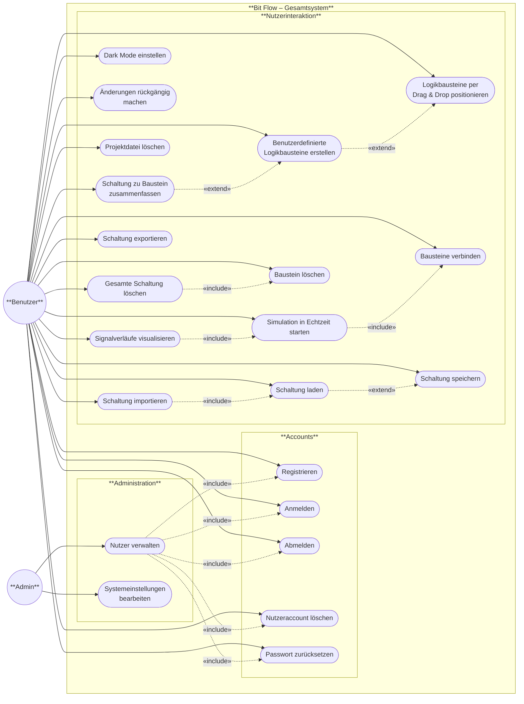
```mermaid
%%{init: {"theme": "default", "flowchart": {"htmlLabels": true}}}%%
graph LR

%% --- Akteure ---
Benutzer(("**Benutzer**"))
Admin(("**Admin**"))

%% --- Systemgrenze ---
subgraph BitFlow["**Bit Flow – Gesamtsystem**"]
    
    %% --- Subsystem: Accounts ---
    subgraph Accounts["**Accounts**"]
        UC1([Registrieren])
        UC2([Anmelden])
        UC3([Abmelden])
        UC13([Nutzeraccount löschen])
        UC14([Passwort zurücksetzen])
    end

    %% --- Subsystem: Administration ---
    subgraph Administration["**Administration**"]
        UC11([Nutzer verwalten])
        UC12([Systemeinstellungen <br> bearbeiten])
    end

    %% --- Subsystem: User Interaction ---
    subgraph UserInteraction["**Nutzerinteraktion**"]
        UC4([Logikbausteine per <br> Drag & Drop positionieren])
        UC5([Bausteine verbinden])
        UC6([Simulation in Echtzeit starten])
        UC7([Benutzerdefinierte <br> Logikbausteine erstellen])
        UC8([Schaltung speichern])
        UC9([Schaltung laden])
        UC10([Signalverläufe visualisieren])
        UC15([Dark Mode einstellen])
        UC16([Änderungen rückgängig <br> machen])
        UC17([Baustein löschen])
        UC18([Gesamte Schaltung löschen])
        UC19([Projektdatei löschen])
        UC20([Schaltung importieren])
        UC21([Schaltung zu Baustein <br> zusammenfassen])
        UC22([Schaltung exportieren])
    end
end

%% --- Beziehungen Benutzer (direkt zu allen Accounts) ---
Benutzer --> UC1
Benutzer --> UC2
Benutzer --> UC3
Benutzer --> UC13
Benutzer --> UC14

%% --- Weitere Benutzerbeziehungen ---
Benutzer --> UC4
Benutzer --> UC5
Benutzer --> UC6
Benutzer --> UC7
Benutzer --> UC8
Benutzer --> UC9
Benutzer --> UC10
Benutzer --> UC15
Benutzer --> UC16
Benutzer --> UC17
Benutzer --> UC18
Benutzer --> UC19
Benutzer --> UC20
Benutzer --> UC21
Benutzer --> UC22

%% --- Administrator nur über Nutzer verwalten / Administration ---
Admin --> UC11
Admin --> UC12

%% --- Include: Admin erreicht alle Accounts über UC11 ---
UC11 -.->|«include»| UC1
UC11 -.->|«include»| UC2
UC11 -.->|«include»| UC3
UC11 -.->|«include»| UC13
UC11 -.->|«include»| UC14

%% --- Weitere Beziehungen zwischen Use Cases ---
UC6 -.->|«include»| UC5
UC7 -.->|«extend»| UC4
UC10 -.->|«include»| UC6
UC9 -.->|«extend»| UC8
UC18 -.->|«include»| UC17
UC21 -.->|«extend»| UC7
UC20 -.->|«include»| UC9

```

### 2.3 Technology Stack
The technology we use is:

Backend:
- **Programmiersprache:** C#  
- **Framework:** ASP.NET Core Web API  
- **API-Tests:** Postman

Frontend:
- **Programmiersprache:** TypeScript  
- **Framework:** React mit Vite  
- **CSS-Framework:** Tailwind CSS  

IDE:
Visual Studio Code & WebStorm

Project Management:
-YouTrack
-GitHub

Deployment (geplant):
- Webhosting über GitHub Pages oder einen ASP.NET-kompatiblen Webserver 

Testing:
- **Unit-Tests:** Jest (Frontend), xUnit (Backend)  
- **Manuelle Tests:** Browserbasierte Oberflächentests  
- **API-Tests:** Postman  

## 3. Specific Requirements

### 3.1 Functionality
#### 3.1.1 UC-01 – Dark Mode einstellen
- **Akteure:** Benutzer  
- **Ziel:** Benutzer möchte das Erscheinungsbild der Webanwendung anpassen, um die Nutzung in dunkler Umgebung zu erleichtern.  
- **Voraussetzungen:** Benutzer ist eingeloggt oder nutzt die Anwendung im Gastmodus.  
- **Auslöser:** Benutzer klickt auf das Einstellungsmenü und aktiviert den Schalter „Dark Mode“.  
- **Hauptablauf:**
	1. Benutzer öffnet das Einstellungsmenü.
	2. Benutzer wählt „Darstellung → Dark Mode“.
	3. System speichert die Einstellung lokal (im Browser-Storage oder Benutzerprofil).
	4. UI wechselt sofort zur dunklen Farbpalette.
- **Alternativabläufe:**  
	- 3a. Wenn Browser LocalStorage deaktiviert: Einstellung wird nur temporär gespeichert.
- **Nachbedingungen:** Oberfläche wird dauerhaft im gewählten Modus angezeigt.  
- **Akzeptanzkriterien:** Farbwechsel erfolgt flüssig; Einstellung bleibt beim nächsten Start erhalten.
- **Sequenzdiagramm:**
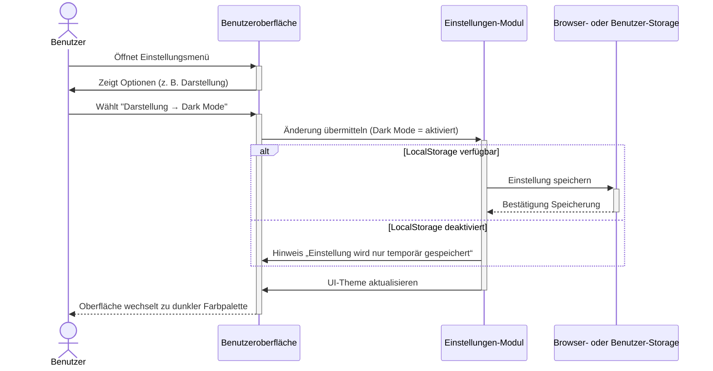
```mermaid
sequenceDiagram
    actor Benutzer
    participant UI as Benutzeroberfläche
    participant System as Einstellungen-Modul
    participant Storage as Browser- oder Benutzer-Storage

    Benutzer ->>+ UI: Öffnet Einstellungsmenü
    UI ->>- Benutzer: Zeigt Optionen (z. B. Darstellung)
    Benutzer ->>+ UI: Wählt "Darstellung → Dark Mode"
    UI ->>+ System: Änderung übermitteln (Dark Mode = aktiviert)

    alt LocalStorage verfügbar
        System ->>+ Storage: Einstellung speichern
        Storage -->>- System: Bestätigung Speicherung
    else LocalStorage deaktiviert
        System ->> UI: Hinweis „Einstellung wird nur temporär gespeichert“
    end

    System ->>- UI: UI-Theme aktualisieren
    UI -->>- Benutzer: Oberfläche wechselt zu dunkler Farbpalette
```

#### 3.1.2 UC-02 – Änderungen rückgängig machen
- **Akteure:** Benutzer  
- **Ziel:** Benutzer möchte versehentliche Aktionen im Schaltplan rückgängig machen.  
- **Voraussetzungen:** Es existiert mindestens eine Aktion im Verlauf.  
- **Auslöser:** Benutzer drückt `Ctrl+Z` oder klickt auf „Rückgängig“.  
- **Hauptablauf:**
	1. Benutzer führt Aktionen im Canvas aus.
	2. System speichert jede Aktion in einem Undo-Stack.
	3. Benutzer löst „Undo“ aus.
	4. System stellt vorherigen Zustand des Canvas wieder her.
- **Alternativabläufe:**  
	- 2a. Kein Undo-Verlauf vorhanden → System zeigt Hinweis „Keine Änderungen rückgängig zu machen“.  
- **Nachbedingungen:** Letzte Änderung ist rückgängig gemacht.  
- **Akzeptanzkriterien:** Alle Aktionen (z. B. Baustein verschieben, Leitung löschen) lassen sich rückgängig machen.
- **Sequenzdiagramm:**
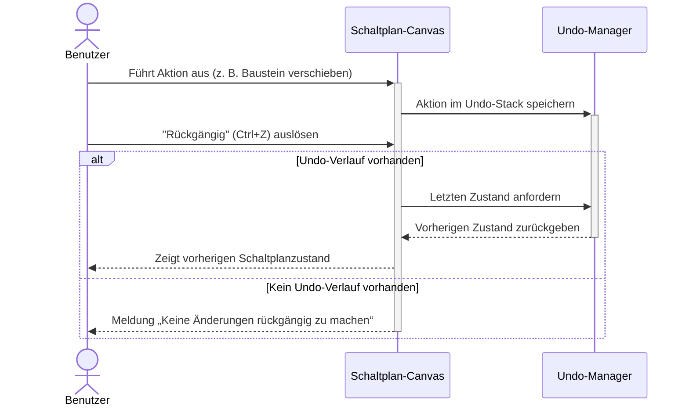
```mermaid
sequenceDiagram
	actor Benutzer
	participant Canvas as Schaltplan-Canvas
	participant System as Undo-Manager

	Benutzer ->>+ Canvas: Führt Aktion aus (z. B. Baustein verschieben)
	Canvas ->>+ System: Aktion im Undo-Stack speichern
	Benutzer ->> Canvas: "Rückgängig" (Ctrl+Z) auslösen
	alt Undo-Verlauf vorhanden
		Canvas ->> System: Letzten Zustand anfordern
		System -->>- Canvas: Vorherigen Zustand zurückgeben
		Canvas -->> Benutzer: Zeigt vorherigen Schaltplanzustand
	else Kein Undo-Verlauf vorhanden
		Canvas -->>- Benutzer: Meldung „Keine Änderungen rückgängig zu machen“
	end
```

#### 3.1.3 UC-03 – Projektdatei löschen
- **Akteure:** Benutzer  
- **Ziel:** Ein bestehendes Projekt soll dauerhaft entfernt werden.  
- **Voraussetzungen:** Benutzer ist eingeloggt und hat Schreibrechte auf das Projekt.  
- **Auslöser:** Benutzer wählt im Projektmanager „Löschen“.  
- **Hauptablauf:**
	1. System zeigt Sicherheitsabfrage an.
	2. Benutzer bestätigt Löschung.
	3. System entfernt Projektdatei aus Cloud- oder LocalStorage.
	4. System aktualisiert Projektliste.  
- **Alternativabläufe:**  
	- 2a. Benutzer bricht ab → Aktion wird verworfen.  
- **Nachbedingungen:** Projektdatei ist gelöscht.  
- **Akzeptanzkriterien:** Gelöschte Datei taucht nicht mehr im Projektmanager auf.
- **Sequenzdiagramm:**
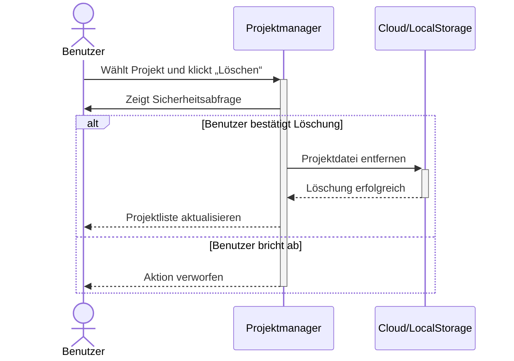
```mermaid
sequenceDiagram
    actor Benutzer
    participant UI as Projektmanager
    participant Storage as Cloud/LocalStorage

    Benutzer ->>+ UI: Wählt Projekt und klickt „Löschen“
    UI ->> Benutzer: Zeigt Sicherheitsabfrage
    alt Benutzer bestätigt Löschung
        UI ->>+ Storage: Projektdatei entfernen
        Storage -->>- UI: Löschung erfolgreich
        UI -->> Benutzer: Projektliste aktualisieren
    else Benutzer bricht ab
        UI -->>- Benutzer: Aktion verworfen
    end

```

#### 3.1.4 UC-04 – Schaltung zu Baustein zusammenfassen
- **Akteure:** Benutzer  
- **Ziel:** Eine bestehende Schaltung soll als wiederverwendbarer Baustein gespeichert werden.  
- **Voraussetzungen:** Schaltung ist vollständig und fehlerfrei.  
- **Auslöser:** Benutzer klickt auf „Als Baustein speichern“.  
- **Hauptablauf:**
	1. Benutzer markiert relevante Schaltungsteile.
	2. System öffnet Dialog „Neuer Logikbaustein“.
	3. Benutzer vergibt Name, Symbol, Beschreibung.
	4. System erstellt Metadatei und speichert Baustein in der Bibliothek.
- **Alternativabläufe:**  
	- 1a. Schaltung enthält unverbundene Pins → Warnung und Möglichkeit zur Korrektur.  
- **Nachbedingungen:** Neuer Baustein steht in der Bibliothek zur Verfügung.  
- **Akzeptanzkriterien:** Baustein kann im nächsten Projekt per Drag & Drop verwendet werden.
- **Sequenzdiagramm:**
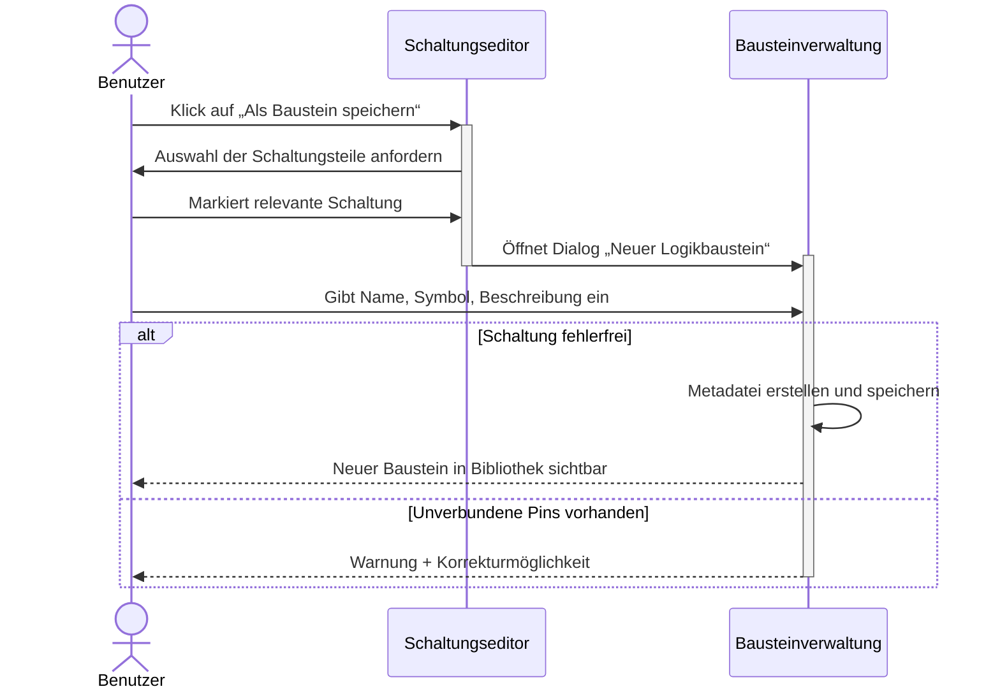
```mermaid
sequenceDiagram
    actor Benutzer
    participant Editor as Schaltungseditor
    participant System as Bausteinverwaltung

    Benutzer ->>+ Editor: Klick auf „Als Baustein speichern“
    Editor ->> Benutzer: Auswahl der Schaltungsteile anfordern
    Benutzer ->> Editor: Markiert relevante Schaltung
    Editor ->>+ System: Öffnet Dialog „Neuer Logikbaustein“
    deactivate Editor
    Benutzer ->> System: Gibt Name, Symbol, Beschreibung ein
    alt Schaltung fehlerfrei
        System ->> System: Metadatei erstellen und speichern
        System -->> Benutzer: Neuer Baustein in Bibliothek sichtbar
    else Unverbundene Pins vorhanden
        System -->>- Benutzer: Warnung + Korrekturmöglichkeit
    end

```

#### 3.1.5 UC-05 – Schaltung exportieren
- **Akteure:** Benutzer  
- **Ziel:** Schaltung in externes Format (z. B. JSON, XML, VHDL) exportieren.  
- **Voraussetzungen:** Projekt geöffnet.  
- **Auslöser:** Klick auf „Exportieren“.  
- **Hauptablauf:**
	1. Benutzer wählt Exportformat.
	2. System generiert Datei und bietet Download an.
	3. Benutzer speichert Datei lokal.  
- **Alternativabläufe:**  
	- 2a. Export fehlschlägt → System zeigt Fehlerdialog mit Log.  
- **Nachbedingungen:** Datei ist im Zielverzeichnis gespeichert.  
- **Akzeptanzkriterien:** Exportierte Datei enthält vollständige Netzliste und Bausteindefinitionen.
- **Sequenzdiagramm:**
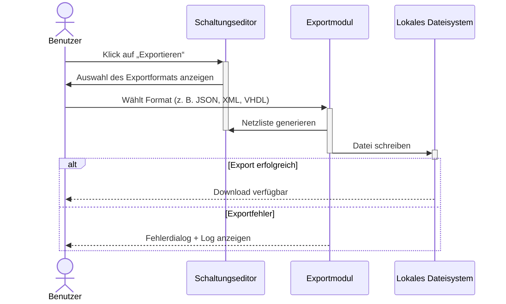
```mermaid
sequenceDiagram
    actor Benutzer
    participant Editor as Schaltungseditor
    participant Exporter as Exportmodul
    participant DateiSystem as Lokales Dateisystem

    Benutzer ->>+ Editor: Klick auf „Exportieren“
    Editor ->> Benutzer: Auswahl des Exportformats anzeigen
    Benutzer ->>+ Exporter: Wählt Format (z. B. JSON, XML, VHDL)
    Exporter ->> Editor: Netzliste generieren
    deactivate Editor
    Exporter ->>+ DateiSystem: Datei schreiben
    deactivate Exporter
    deactivate DateiSystem
    alt Export erfolgreich
        DateiSystem -->> Benutzer: Download verfügbar
    else Exportfehler
        Exporter -->> Benutzer: Fehlerdialog + Log anzeigen
    end

```

#### 3.1.6 UC-06 – Gesamte Schaltung löschen
- **Akteure:** Benutzer  
- **Ziel:** Der Benutzer möchte das aktuelle Canvas vollständig leeren.  
- **Voraussetzungen:** Schaltung ist geladen.  
- **Auslöser:** Klick auf „Alles löschen“.  
- **Hauptablauf:**
	1. System fragt nach Bestätigung.
	2. Benutzer bestätigt.
	3. System löscht alle Bausteine und Leitungen.
- **Alternativabläufe:**  
	- 2a. Benutzer bricht ab → keine Änderung.  
- **Nachbedingungen:** Canvas ist leer.  
- **Akzeptanzkriterien:** Kein Element verbleibt sichtbar.
- **Sequenzdiagramm:**
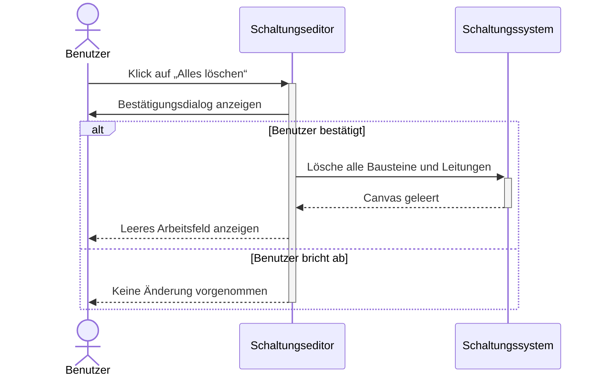
```mermaid
sequenceDiagram
    actor Benutzer
    participant Editor as Schaltungseditor
    participant System as Schaltungssystem

    Benutzer ->>+ Editor: Klick auf „Alles löschen“
    Editor ->> Benutzer: Bestätigungsdialog anzeigen
    alt Benutzer bestätigt
        Editor ->>+ System: Lösche alle Bausteine und Leitungen
        System -->>- Editor: Canvas geleert
        Editor -->> Benutzer: Leeres Arbeitsfeld anzeigen
    else Benutzer bricht ab
        Editor -->>- Benutzer: Keine Änderung vorgenommen
    end

```

#### 3.1.7 UC-07 – Signalverläufe visualisieren
- **Akteure:** Benutzer  
- **Ziel:** Benutzer möchte die zeitlichen Signaländerungen im Diagramm sehen.  
- **Voraussetzungen:** Simulation wurde ausgeführt.  
- **Auslöser:** Klick auf „Signalverlauf anzeigen“.  
- **Hauptablauf:**
	1. System öffnet Signalviewer.
	2. Benutzer wählt Knoten oder Leitungen.
	3. System zeigt Wellenformen in Echtzeit oder Zeitachse.  
- **Alternativabläufe:**  
	- 2a. Kein Signal gewählt → Meldung „Bitte Leitung auswählen“.  
- **Nachbedingungen:** Signaldiagramm ist sichtbar.  
- **Akzeptanzkriterien:** Werteänderungen stimmen mit Simulation überein.
- **Sequenzdiagramm:**
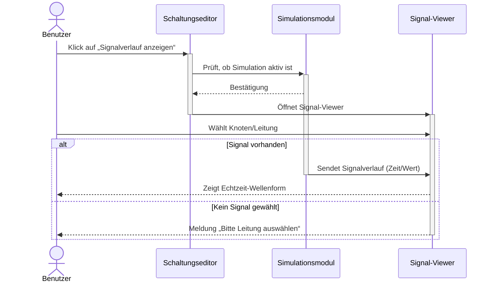
```mermaid
sequenceDiagram
    actor Benutzer
    participant UI as Schaltungseditor
    participant Simulation as Simulationsmodul
    participant Viewer as Signal-Viewer

    Benutzer ->>+ UI: Klick auf „Signalverlauf anzeigen“
    UI ->>+ Simulation: Prüft, ob Simulation aktiv ist
    Simulation -->> UI: Bestätigung
    UI ->>+ Viewer: Öffnet Signal-Viewer
    deactivate UI
    Benutzer ->> Viewer: Wählt Knoten/Leitung
    alt Signal vorhanden
        Simulation ->> Viewer: Sendet Signalverlauf (Zeit/Wert)
        deactivate Simulation
        Viewer -->> Benutzer: Zeigt Echtzeit-Wellenform
    else Kein Signal gewählt
        Viewer -->>- Benutzer: Meldung „Bitte Leitung auswählen“
    end

```

#### 3.1.8 UC-08 – Schaltung importieren
- **Akteure:** Benutzer  
- **Ziel:** Bestehende Schaltung aus Datei laden.  
- **Voraussetzungen:** Datei vorhanden, gültiges Format.  
- **Auslöser:** Klick auf „Importieren“.  
- **Hauptablauf:**
	1. Benutzer wählt Datei.
	2. System liest Datei ein und validiert Format.
	3. Schaltung wird ins Canvas geladen.  
- **Alternativabläufe:**  
	- 2a. Datei fehlerhaft → Fehlerdialog.  
- **Nachbedingungen:** Schaltung ist geladen.  
- **Akzeptanzkriterien:** Alle Bausteine korrekt platziert.
- **Sequenzdiagramm:**
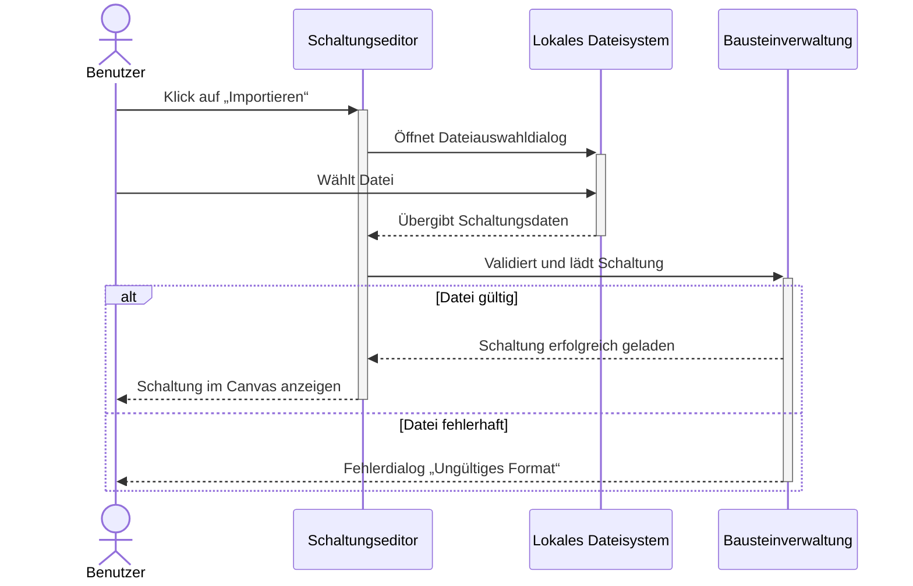
```mermaid
sequenceDiagram
    actor Benutzer
    participant UI as Schaltungseditor
    participant DateiSystem as Lokales Dateisystem
    participant System as Bausteinverwaltung

    Benutzer ->>+ UI: Klick auf „Importieren“
    UI ->>+ DateiSystem: Öffnet Dateiauswahldialog
    Benutzer ->> DateiSystem: Wählt Datei
    DateiSystem -->>- UI: Übergibt Schaltungsdaten
    UI ->>+ System: Validiert und lädt Schaltung
    alt Datei gültig
        System -->> UI: Schaltung erfolgreich geladen
        UI -->>- Benutzer: Schaltung im Canvas anzeigen
    else Datei fehlerhaft
        System -->>- Benutzer: Fehlerdialog „Ungültiges Format“
    end

```

#### 3.1.9 UC-09 – Benutzerdefinierte Logikbausteine erstellen
- **Akteure:** Benutzer  
- **Ziel:** Eigene Bausteine mit individuellem Verhalten definieren.  
- **Voraussetzungen:** Benutzer hat Schreibrechte in Bibliothek.  
- **Auslöser:** Menü „Neuer Baustein“.  
- **Hauptablauf:**
	1. System öffnet Baustein-Editor.
	2. Benutzer legt Pins, Symbole, Logik (z. B. durch Wahrheitstabelle) fest.
	3. System kompiliert und speichert Baustein.  
- **Alternativabläufe:**  
	- 3a. Kompilierungsfehler → Benutzer erhält Fehlermeldung.  
- **Nachbedingungen:** Neuer Baustein steht zur Verwendung bereit.  
- **Akzeptanzkriterien:** Baustein erscheint in Bibliothek und funktioniert korrekt.
- **Sequenzdiagramm:**
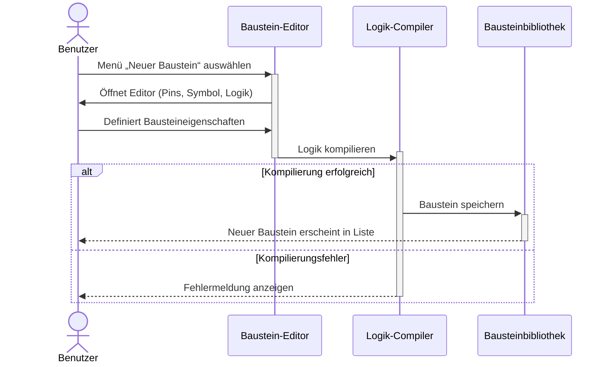
```mermaid
sequenceDiagram
    actor Benutzer
    participant Editor as Baustein-Editor
    participant Compiler as Logik-Compiler
    participant Bibliothek as Bausteinbibliothek

    Benutzer ->>+ Editor: Menü „Neuer Baustein“ auswählen
    Editor ->> Benutzer: Öffnet Editor (Pins, Symbol, Logik)
    Benutzer ->> Editor: Definiert Bausteineigenschaften
    Editor ->>+ Compiler: Logik kompilieren
    deactivate Editor
    alt Kompilierung erfolgreich
        Compiler ->>+ Bibliothek: Baustein speichern
        Bibliothek -->>- Benutzer: Neuer Baustein erscheint in Liste
    else Kompilierungsfehler
        Compiler -->>- Benutzer: Fehlermeldung anzeigen
    end

```

#### 3.1.10 UC-10 – Logikbausteine per Drag & Drop positionieren
- **Akteure:** Benutzer  
- **Ziel:** Bausteine intuitiv auf dem Canvas platzieren.  
- **Voraussetzungen:** Schaltung geöffnet.  
- **Auslöser:** Benutzer zieht Element aus Bibliothek.  
- **Hauptablauf:**
	1. Benutzer wählt Baustein.
	2. Drag & Drop auf Canvas.
	3. System platziert Baustein und registriert im Netlist-Model.  
- **Alternativabläufe:**  
	- 3a. Kollision mit bestehendem Objekt → automatische Verschiebung.  
- **Nachbedingungen:** Baustein auf Canvas platziert.  
- **Akzeptanzkriterien:** Drag & Drop funktioniert flüssig.
- **Sequenzdiagramm:**
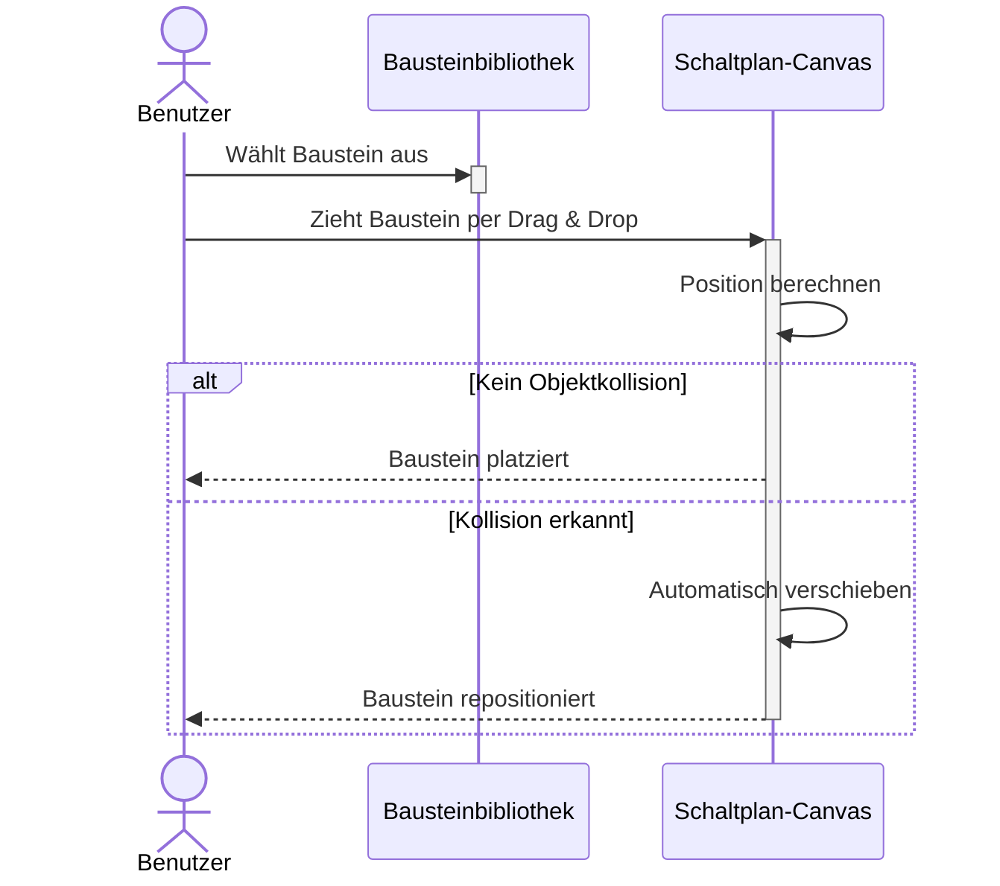
```mermaid
sequenceDiagram
    actor Benutzer
    participant Bibliothek as Bausteinbibliothek
    participant Canvas as Schaltplan-Canvas

    Benutzer ->>+ Bibliothek: Wählt Baustein aus
    deactivate Bibliothek
    Benutzer ->>+ Canvas: Zieht Baustein per Drag & Drop
    Canvas ->> Canvas: Position berechnen
    alt Kein Objektkollision
        Canvas -->> Benutzer: Baustein platziert
    else Kollision erkannt
        Canvas ->> Canvas: Automatisch verschieben
        Canvas -->>- Benutzer: Baustein repositioniert
    end

```

#### 3.1.11 UC-11 – Bausteine verbinden
- **Akteure:** Benutzer  
- **Ziel:** Bausteine logisch miteinander verbinden.  
- **Voraussetzungen:** Zwei oder mehr Bausteine auf Canvas.  
- **Auslöser:** Klick und Ziehen von Pin zu Pin.  
- **Hauptablauf:**
	1. Benutzer startet Verbindung am Ausgangspin.
	2. System zeigt Gummiband-Leitung.
	3. Benutzer verbindet mit Zielpin.
	4. System validiert Verbindung.  
- **Alternativabläufe:**  
	- 4a. Ungültige Verbindung → rote Leitung, Fehlertext.  
- **Nachbedingungen:** Signalleitung hergestellt.  
- **Akzeptanzkriterien:** Verbindung korrekt in Simulation berücksichtigt.
- **Sequenzdiagramm:**
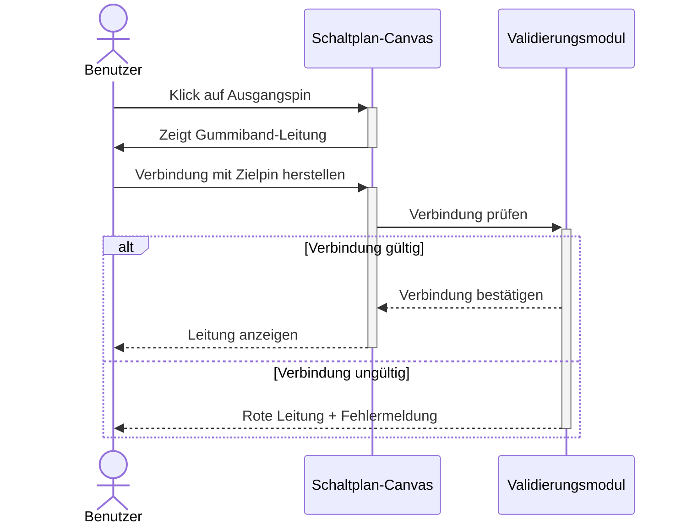
```mermaid
sequenceDiagram
    actor Benutzer
    participant Canvas as Schaltplan-Canvas
    participant System as Validierungsmodul

    Benutzer ->>+ Canvas: Klick auf Ausgangspin
    Canvas ->>- Benutzer: Zeigt Gummiband-Leitung
    Benutzer ->>+ Canvas: Verbindung mit Zielpin herstellen
    Canvas ->>+ System: Verbindung prüfen
    alt Verbindung gültig
        System -->> Canvas: Verbindung bestätigen
        Canvas -->>- Benutzer: Leitung anzeigen
    else Verbindung ungültig
        System -->>- Benutzer: Rote Leitung + Fehlermeldung
    end

```

#### 3.1.12 UC-12 – Baustein löschen
- **Akteure:** Benutzer  
- **Ziel:** Baustein aus Schaltung entfernen.  
- **Voraussetzungen:** Baustein ausgewählt.  
- **Auslöser:** Tastendruck `Entf`.  
- **Hauptablauf:**
	1. System entfernt Baustein und zugehörige Leitungen.
	2. Canvas aktualisiert.  
- **Nachbedingungen:** Baustein nicht mehr vorhanden.  
- **Akzeptanzkriterien:** Keine unverbundenen Leitungen verbleiben.
- **Sequenzdiagramm:**
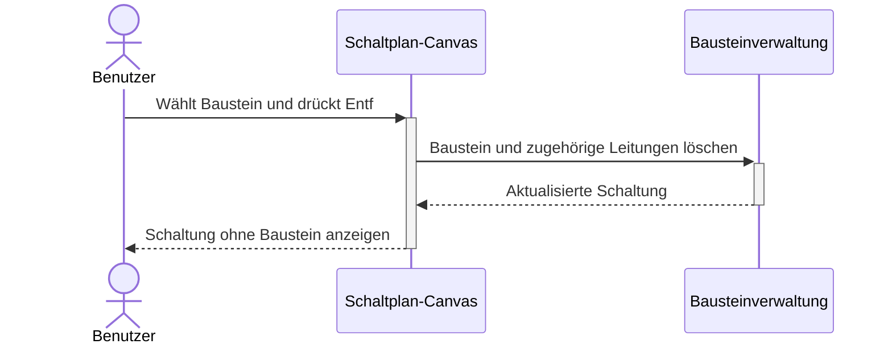
```mermaid
sequenceDiagram
    actor Benutzer
    participant Canvas as Schaltplan-Canvas
    participant System as Bausteinverwaltung

    Benutzer ->>+ Canvas: Wählt Baustein und drückt Entf
    Canvas ->>+ System: Baustein und zugehörige Leitungen löschen
    System -->>- Canvas: Aktualisierte Schaltung
    Canvas -->>- Benutzer: Schaltung ohne Baustein anzeigen

```

#### 3.1.13 UC-13 – Simulation in Echtzeit starten
- **Akteure:** Benutzer  
- **Ziel:** Verhalten der Schaltung prüfen.  
- **Voraussetzungen:** Vollständige, fehlerfreie Schaltung.  
- **Auslöser:** Klick auf „Simulieren“.  
- **Hauptablauf:**
	1. System prüft Netzliste.
	2. Simulation startet in WebAssembly-Modul.
	3. LEDs, Anzeigen und Signale aktualisieren sich live.  
- **Alternativabläufe:**  
	- 2a. Fehlerhafte Netzliste → Abbruch mit Meldung.  
- **Nachbedingungen:** Simulation beendet oder pausiert.  
- **Akzeptanzkriterien:** Echtzeitsimulation reagiert korrekt auf Eingaben.
- **Sequenzdiagramm:**
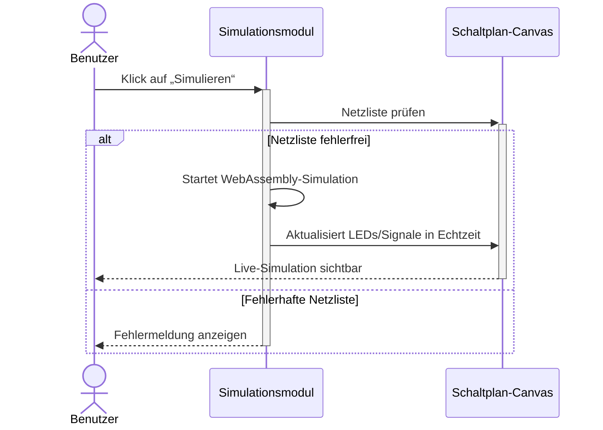
```mermaid
sequenceDiagram
    actor Benutzer
    participant System as Simulationsmodul
    participant Canvas as Schaltplan-Canvas

    Benutzer ->>+ System: Klick auf „Simulieren“
    System ->>+ Canvas: Netzliste prüfen
    alt Netzliste fehlerfrei
        System ->> System: Startet WebAssembly-Simulation
        System ->> Canvas: Aktualisiert LEDs/Signale in Echtzeit
        Canvas -->>- Benutzer: Live-Simulation sichtbar
    else Fehlerhafte Netzliste
        System -->>- Benutzer: Fehlermeldung anzeigen
    end

```

#### 3.1.14 UC-14 – Schaltung speichern
- **Akteure:** Benutzer  
- **Ziel:** Aktuelle Arbeit sichern.  
- **Voraussetzungen:** Schaltung geöffnet.  
- **Auslöser:** Klick auf „Speichern“ oder `Ctrl+S`.  
- **Hauptablauf:**
	1. System speichert Datei in Cloud oder lokal.
	2. Versionsnummer wird angehoben.  
- **Nachbedingungen:** Schaltung gespeichert.  
- **Akzeptanzkriterien:** Datei im Projektmanager sichtbar.
- **Sequenzdiagramm:**
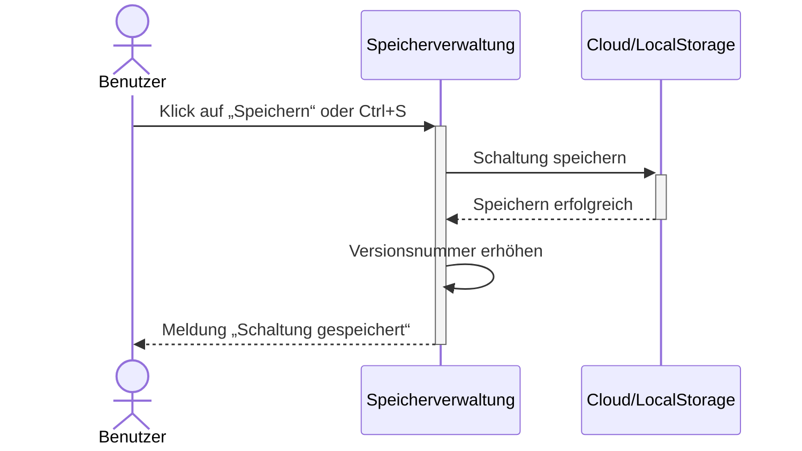
```mermaid
sequenceDiagram
    actor Benutzer
    participant System as Speicherverwaltung
    participant Cloud as Cloud/LocalStorage

    Benutzer ->>+ System: Klick auf „Speichern“ oder Ctrl+S
    System ->>+ Cloud: Schaltung speichern
    Cloud -->>- System: Speichern erfolgreich
    System ->> System: Versionsnummer erhöhen
    System -->>- Benutzer: Meldung „Schaltung gespeichert“

```

#### 3.1.15 UC-15 – Schaltung laden
- **Akteure:** Benutzer  
- **Ziel:** Frühere Schaltung öffnen.  
- **Auslöser:** Klick auf „Laden“.  
- **Hauptablauf:**
	1. System zeigt Projektliste.
	2. Benutzer wählt Projekt.
	3. System lädt Schaltung ins Canvas.  
- **Nachbedingungen:** Schaltung verfügbar.  
- **Akzeptanzkriterien:** Vollständiger Zustand geladen.
- **Sequenzdiagramm:**
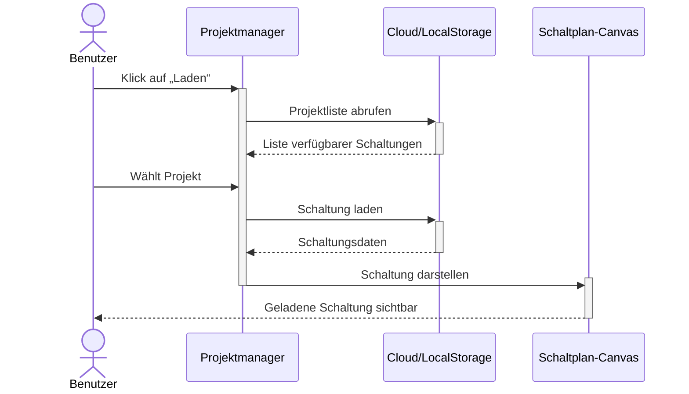
```mermaid
sequenceDiagram
    actor Benutzer
    participant System as Projektmanager
    participant Cloud as Cloud/LocalStorage
    participant Canvas as Schaltplan-Canvas

    Benutzer ->>+ System: Klick auf „Laden“
    System ->>+ Cloud: Projektliste abrufen
    Cloud -->>- System: Liste verfügbarer Schaltungen
    Benutzer ->> System: Wählt Projekt
    System ->>+ Cloud: Schaltung laden
    Cloud -->>- System: Schaltungsdaten
    System ->>+ Canvas: Schaltung darstellen
    deactivate System
    Canvas -->>- Benutzer: Geladene Schaltung sichtbar

```

#### 3.1.16 UC-16 – Nutzer verwalten
- **Akteure:** Administrator  
- **Ziel:** Benutzerkonten prüfen, sperren oder bearbeiten.  
- **Voraussetzungen:** Administrator ist eingeloggt.  
- **Auslöser:** Menü „Administration → Nutzer verwalten“.  
- **Hauptablauf:**
	1. System zeigt Benutzerliste.
	2. Admin bearbeitet Status, Rechte oder löscht Konten.
	3. Änderungen werden gespeichert.  
- **Nachbedingungen:** Nutzerdaten aktualisiert.  
- **Akzeptanzkriterien:** Änderungen sofort wirksam.
- **Sequenzdiagramm:**
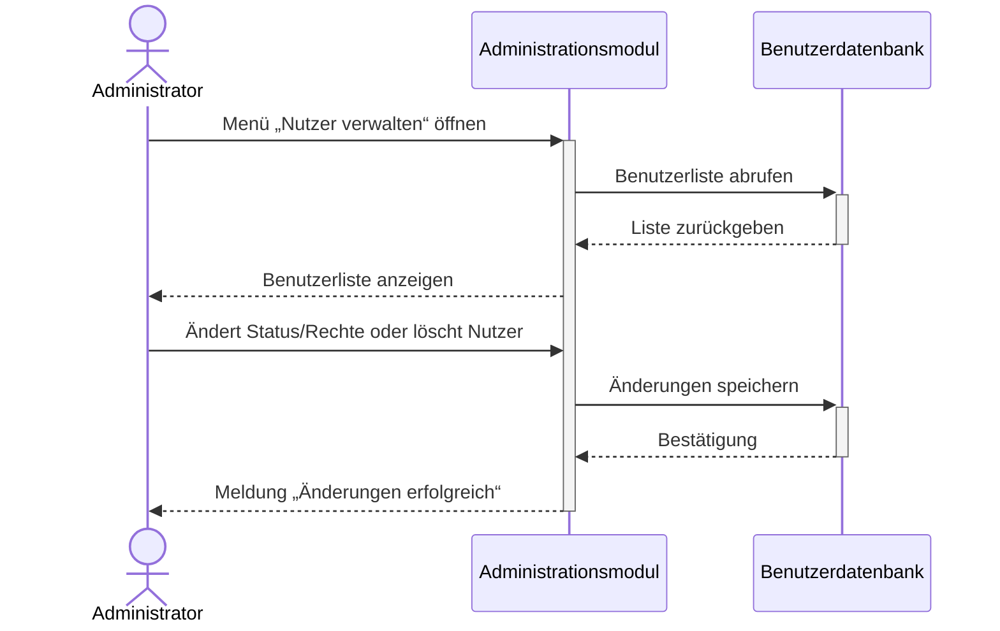
```mermaid
sequenceDiagram
    actor Administrator
    participant System as Administrationsmodul
    participant DB as Benutzerdatenbank

    Administrator ->>+ System: Menü „Nutzer verwalten“ öffnen
    System ->>+ DB: Benutzerliste abrufen
    DB -->>- System: Liste zurückgeben
    System -->> Administrator: Benutzerliste anzeigen
    Administrator ->> System: Ändert Status/Rechte oder löscht Nutzer
    System ->>+ DB: Änderungen speichern
    DB -->>- System: Bestätigung
    System -->>- Administrator: Meldung „Änderungen erfolgreich“

```

#### 3.1.17 UC-17 – Systemeinstellungen bearbeiten
- **Akteure:** Administrator  
- **Ziel:** Globale Systemeinstellungen anpassen.  
- **Voraussetzungen:** Administratorzugriff.  
- **Auslöser:** Menü „Systemeinstellungen“.  
- **Hauptablauf:**
	1. Admin öffnet Einstellungsmaske.
	2. Nimmt Änderungen vor (z. B. Serverpfade, Simulationstakte).
	3. System speichert und lädt neu.  
- **Nachbedingungen:** Neue Einstellungen aktiv.  
- **Akzeptanzkriterien:** Änderungen korrekt übernommen.
- **Sequenzdiagramm:**
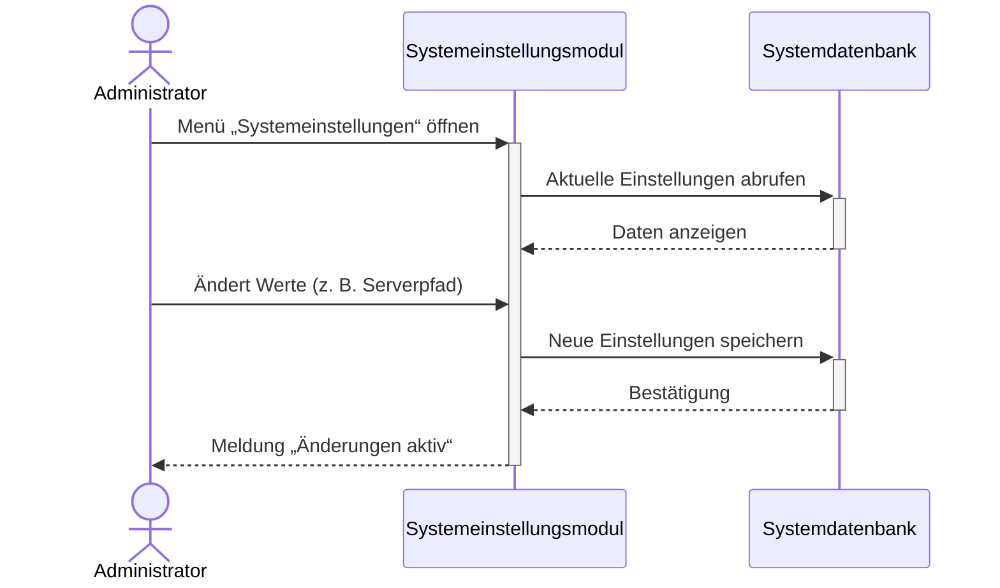
```mermaid
sequenceDiagram
    actor Administrator
    participant System as Systemeinstellungsmodul
    participant DB as Systemdatenbank

    Administrator ->>+ System: Menü „Systemeinstellungen“ öffnen
    System ->>+ DB: Aktuelle Einstellungen abrufen
    DB -->>- System: Daten anzeigen
    Administrator ->> System: Ändert Werte (z. B. Serverpfad)
    System ->>+ DB: Neue Einstellungen speichern
    DB -->>- System: Bestätigung
    System -->>- Administrator: Meldung „Änderungen aktiv“

```

#### 3.1.18 UC-18 – Registrieren
- **Akteure:** Benutzer  
- **Ziel:** Neues Konto anlegen.  
- **Auslöser:** Klick auf „Registrieren“.  
- **Hauptablauf:**
	1. Benutzer gibt E-Mail, Passwort und Namen ein.
	2. System validiert Eingaben.
	3. Konto wird erstellt.  
- **Alternativabläufe:**  
	- 2a. E-Mail existiert → Fehlermeldung.  
- **Nachbedingungen:** Neues Konto angelegt.  
- **Akzeptanzkriterien:** Benutzer kann sich anschließend anmelden.
- **Sequenzdiagramm:**
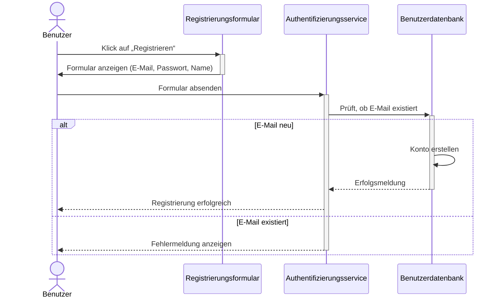
```mermaid
sequenceDiagram
    actor Benutzer
    participant UI as Registrierungsformular
    participant System as Authentifizierungsservice
    participant DB as Benutzerdatenbank

    Benutzer ->>+ UI: Klick auf „Registrieren“
    UI ->>- Benutzer: Formular anzeigen (E-Mail, Passwort, Name)
    Benutzer ->>+ System: Formular absenden
    System ->>+ DB: Prüft, ob E-Mail existiert
    alt E-Mail neu
        DB ->> DB: Konto erstellen
        DB -->>- System: Erfolgsmeldung
        System -->> Benutzer: Registrierung erfolgreich
    else E-Mail existiert
        System -->>- Benutzer: Fehlermeldung anzeigen
    end

```

#### 3.1.19 UC-19 – Anmelden
- **Akteure:** Benutzer  
- **Ziel:** Zugriff auf persönliche Projekte.  
- **Auslöser:** Klick auf „Login“.  
- **Hauptablauf:**
	1. Benutzer gibt Zugangsdaten ein.
	2. System prüft Authentifizierung.
	3. Zugriff gewährt.  
- **Alternativabläufe:**  
	- 2a. Passwort falsch → Fehlermeldung.  
- **Nachbedingungen:** Benutzer eingeloggt.  
- **Akzeptanzkriterien:** Zugang nur bei korrekten Daten.
- **Sequenzdiagramm:**
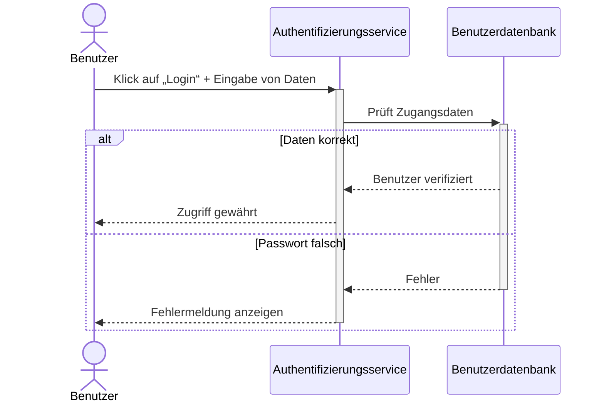
```mermaid
sequenceDiagram
    actor Benutzer
    participant System as Authentifizierungsservice
    participant DB as Benutzerdatenbank

    Benutzer ->>+ System: Klick auf „Login“ + Eingabe von Daten
    System ->>+ DB: Prüft Zugangsdaten
    alt Daten korrekt
        DB -->> System: Benutzer verifiziert
        System -->> Benutzer: Zugriff gewährt
    else Passwort falsch
        DB -->>- System: Fehler
        System -->>- Benutzer: Fehlermeldung anzeigen
    end

```

#### 3.1.20 UC-20 – Abmelden
- **Akteure:** Benutzer  
- **Ziel:** Sitzung sicher beenden.  
- **Auslöser:** Klick auf „Logout“.  
- **Hauptablauf:**
	1. System löscht Session-Cookies.
	2. Benutzer wird zur Startseite geleitet.  
- **Nachbedingungen:** Sitzung beendet.  
- **Akzeptanzkriterien:** Kein Zugriff mehr auf geschützte Bereiche.
- **Sequenzdiagramm:**
```mermaid
sequenceDiagram
    actor Benutzer
    participant System as Sitzungsverwaltung
    participant Browser as Client-Session

    Benutzer ->> +System: Klick auf „Logout“
    System ->>+ Browser: Session-Cookies löschen
    deactivate Browser
    System -->>- Benutzer: Weiterleitung zur Startseite

```

#### 3.1.21 UC-21 – Nutzeraccount löschen
- **Akteure:** Administrator oder Benutzer (selbst).  
- **Ziel:** Konto entfernen.  
- **Voraussetzungen:** Authentifiziert.  
- **Auslöser:** Klick auf „Account löschen“.  
- **Hauptablauf:**
	1. System fragt nach Bestätigung.
	2. Benutzer bestätigt.
	3. Daten werden gelöscht.  
- **Nachbedingungen:** Konto entfernt, Daten anonymisiert.  
- **Akzeptanzkriterien:** Kein Login mehr möglich.
- **Sequenzdiagramm:**
```mermaid
sequenceDiagram
    actor Benutzer
    participant System as Kontoverwaltung
    participant DB as Benutzerdatenbank

    Benutzer ->>+ System: Klick auf „Account löschen“
    System ->> Benutzer: Sicherheitsabfrage anzeigen
    alt Benutzer bestätigt
        System ->>+ DB: Benutzerdaten löschen/anonymisieren
        DB -->>- System: Bestätigung
        System -->> Benutzer: Konto entfernt, Logout
    else Benutzer bricht ab
        System -->>- Benutzer: Aktion verworfen
    end

```

#### 3.1.22 UC-22 – Passwort zurücksetzen
- **Akteure:** Benutzer  
- **Ziel:** Passwort wiederherstellen.  
- **Auslöser:** Klick auf „Passwort vergessen“.  
- **Hauptablauf:**
	1. Benutzer gibt E-Mail-Adresse ein.
	2. System sendet Link.
	3. Benutzer setzt neues Passwort.  
- **Nachbedingungen:** Neues Passwort gültig.  
- **Akzeptanzkriterien:** Login mit neuem Passwort möglich.
- **Sequenzdiagramm:**
```mermaid
sequenceDiagram
    actor Benutzer
    participant System as Authentifizierungsservice
    participant Mail as E-Mail-Service
    participant DB as Benutzerdatenbank

    Benutzer ->>+ System: Klick auf „Passwort vergessen“
    System ->>+ Benutzer: E-Mail-Adresse eingeben
    Benutzer ->>- System: Adresse absenden
    System ->>+ DB: Prüft Benutzerkonto
    alt Konto vorhanden
        System ->>+ Mail: Sende Passwort-Link
        Mail -->>+ Benutzer: E-Mail mit Reset-Link
        deactivate Mail
        Benutzer ->>- System: Öffnet Link und setzt neues Passwort
        System ->> DB: Passwort aktualisieren
        DB -->>- System: Bestätigung
        System -->> Benutzer: Neues Passwort aktiv
    else Konto nicht gefunden
        System -->>- Benutzer: Fehlermeldung anzeigen
    end
```

### 3.2 Usability

- **Schnell erfassbar:** Minimaler Einarbeitungsaufwand durch intuitives GUI.

- **Erkundbarkeit:** Kontext-Menüs, konfigurierbarer Toolbar, direkte Inline-Hilfe (Hover-Tootips).

- **Effizienz:** Tastaturkürzel für alle häufigen Aktionen (Place Gate, Connect, Delete, Save, Simulate, Step).

- **Konsistenz:** Einheitliche Icons, responsive Panels, konsistente Zeichen- und Snap-Regeln wie in Desktop-Editoren.

- **Fehlertoleranz:** Undo/Redo unbegrenzt (bis zu Speichergrenze), Safety-Prompts bei destruktiven Aktionen.

### 3.3 Reliability

- **Autosave & Checkpoints:** Automatisches Speichern alle X Sekunden (konfigurierbar), inkrementelle Snapshots für Recovery.

- **Crash des Browsers:** beim Reopen wird letzte Autosave-Version angeboten.

- **Autosave & Checkpoints:** Automatisches Speichern alle X Sekunden (konfigurierbar)

- **Fehlerresistenz:** Simulator-Engine isoliert in Worker-Prozessen (WebWorker/WASM), Abstürze des Simulations-Threads beeinflussen UI nicht.

### 3.4 Perfomance

- UI-Startzeit + Interaktions-Latenz gering.

- **Simulation:** kleine Schaltungen in-browser in Echtzeit

### 3.5 Supportability
- **Server-Side Logs:** Structured logging, correlation-id für Requests (Traceability).

### 3.6 Design Constraints
- **Browser-Support:** Ziel: aktuelle Chrome, Firefox, Edge.

### 3.7 On-line User Documentation and Help System Requirements
Da es sich um eine einfache Anwendung handelt, die von dem Entwicklerteam so intuitiv wie möglich gestaltet wird, ist keine Ausführliche Dokumentation notwendig.
Falls gewünscht, wird ein Hilfe-Button in die Anwendung hinzugefügt, über welche man sich auf GitHub an das Entwicklerteam wenden kann.

### 3.8 Purchased Components
Es ist nicht geplant Komponenten zu kaufen.

### 3.9 Interfaces
User Interfaces:
- Grafische Benutzeroberfläche (GUI) mit Drag-and-Drop-Funktion für Logikbausteine.
- Menüstruktur zum Laden, Speichern, Importieren und Exportieren von Projekten.
- Schaltflächen zur Simulation, Rückgängig-Funktion und Visualisierung von Signalverläufen.
- Einstellungsbereich für Dark Mode und Systemeinstellungen.
- Fehlermeldungen und Statusanzeigen (z. B. „Simulation gestartet“, „Fehler in Schaltung“).

### 3.10 Licensing Requirements
Dieses Projekt wurde zu Lernzwecken entwickelt. Es wird ohne Gewährleistung oder Support bereitgestellt. Das Entwicklerteam übernimmt keine Verantwortung für eventuelle Fehler oder Schäden, die aus der Nutzung resultieren.

## 4. Supporting Information
For any further information you can check out the Blog on out [GitHub Discussions Page](https://github.com/SimonJ2222/BitFlow/discussions). 
The Team Members are:
- Mohid Syed
- Florian Blum
- Moritz Czekalski
- Simon Just
